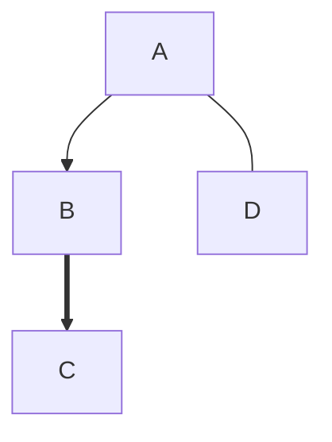
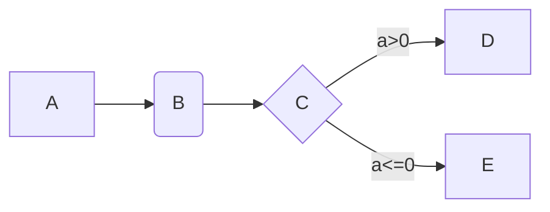
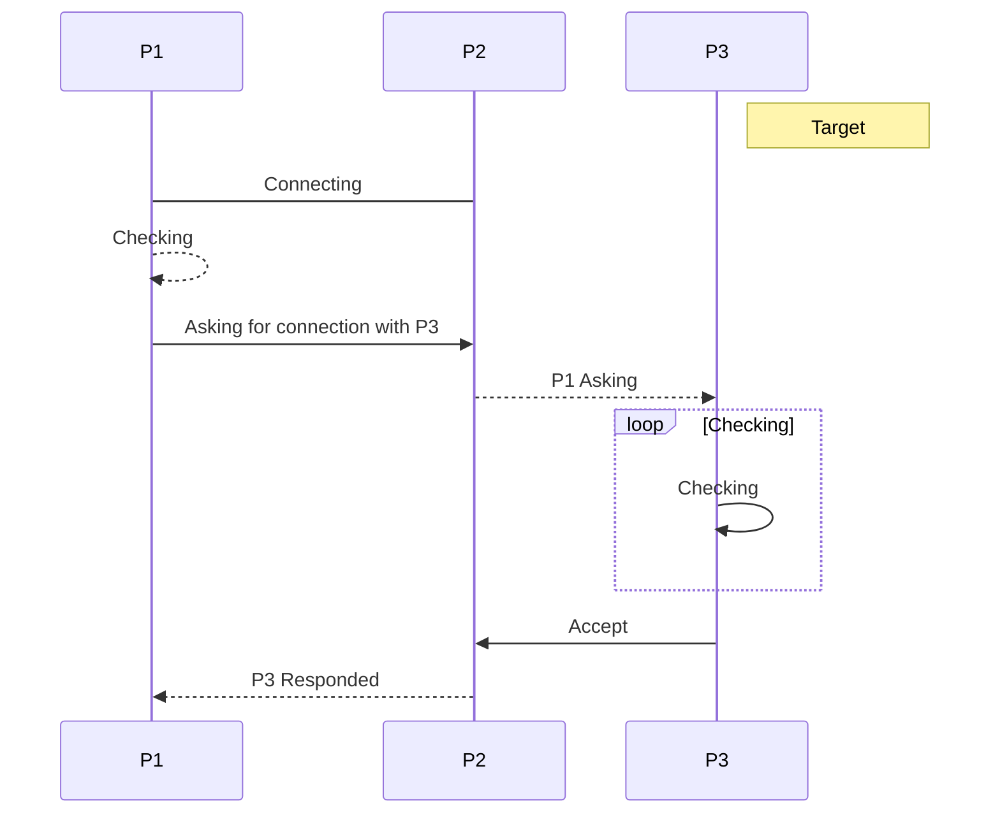
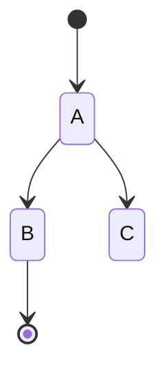
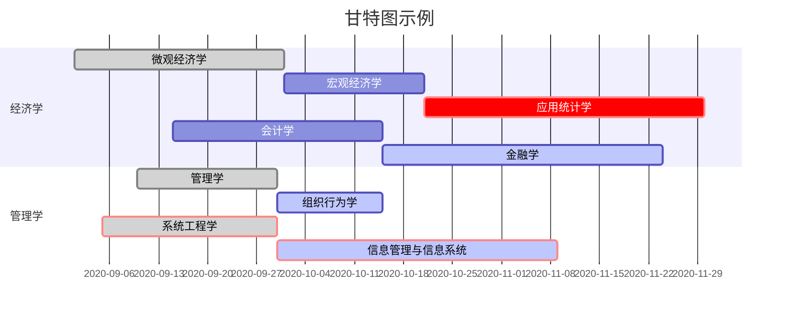
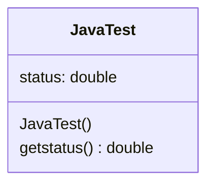
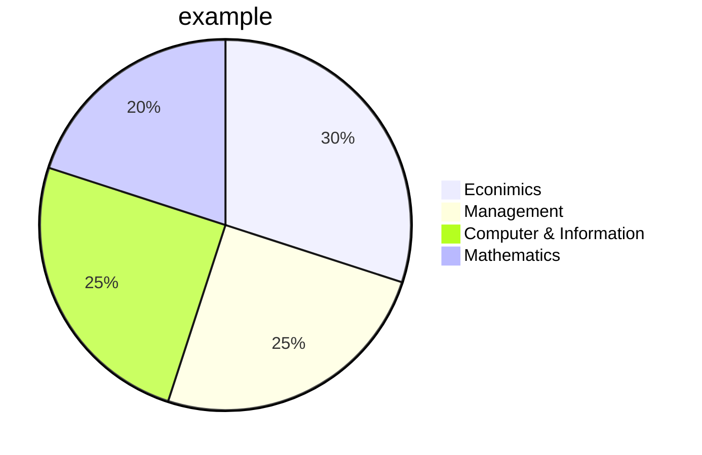

# 零、目录 

[toc]

*(目录通过输入  [toc]  实现)* :gem: 

# 一、标题

# 一级标题
## 二级标题
### 三级标题
#### 四级标题
##### 五级标题
###### 六级标题
####### 没有七级标题  


一级标题
===
二级标题
---  

***
# 二、段落
分段：两个空格+回车  

:unicorn:（Unicode表情符）

如果没有空格，
效果是这样子  
分割线:  

- - -
---
* * *
***
# 三、字体
*斜体* _斜体_  
**粗体** __粗体__  
***粗斜体*** ___粗斜体___  
~~删除线~~  
<u>下划线</u>  
脚注 [^显示文本]  
~下~标 H~2~O
^上^标 a^2^=4
==高亮== enth==us==iastic

[^显示文本]: 隐藏文本  

转义符：\  
支持的字符：
\` \* \_ \{\} \[\] \(\) \# \+ \- \. \! \\  
***

# 三、列表
* 无序列表
+ 加号减号或星号
- 列表符号后必须加空格
1. 有序列表
2. 有序列表
3. 列表符号后必须加空格
    - 嵌套列表
    - 在列表符号前加四个空格
        * 嵌套列表
            + 嵌套列表  
- [ ] 任务清单
- [x] 已完成的任务

***
# 四、区块
> 区块  
> 大于号
>
> > 嵌套区块  
> > * 无序列表
> > 1. 有序列表
> > > 嵌套区块
> > > > 嵌套区块  
> > > > > 嵌套区块  
> > > > > > 嵌套区块
> > > > > > > 嵌套区块
> > > > > > > > 嵌套区块
> > > > > > > > > 嵌套区块
> > > > > > > > > > 嵌套区块
> > > > > > > > > > > 嵌套区块
> > > > > > > > > > >
> > > > > > > > > > > > 嵌套区块  

***
# 五、代码
`main()` 示例代码段 反引号:<kbd>~ `</kbd>  
代码区块(tab或四个空格)  

    print('Hello World!)  


代码区块(由三个反引号和语言类型包裹代码)  


```go
package main

import "fmt"

func main() {
    fmt.Println("Hello World")
```
***
# 六、链接
这是一个链接 [4399](http://www.4399.com)  
<b>R.I.P flash(1996~2020)</b>  
用变量代替链接 [360][a]  

[a]: https://www.360.cn
直接使用链接地址<https://www.baidu.com>  
***
# 七、图片  
  
或者利用html格式：(可调节尺寸)  
    

***
# 八、表格  
|普通表头|左对齐表头|右对齐表头|居中对齐表头|
|---------|:--------|---------:|:---------:|
|单元格1|单元格2|单元格3|单元格4|
|单元格1|单元格2|单元格3|单元格4|
|单元格1|单元格2|单元格3|单元格4|
***
# 九、html元素  
键盘：<kbd>Ctrl</kbd>  
<b>加粗</b>  
<i>斜体</i> <em>斜体</em>  
<sup>上标</sup>  
<sub>下标</sub>  
<!--注释-->

<p style="color:red">颜色</p>

<br>

***
# 十、LaTeX公式  


$$
\alpha^2+\beta^2=1
$$
$$
\LaTeX
$$
***
# 十一、流程图




# 十二、时序图



# 十三、状态图



# 十四、甘特图



# 十五、类图




# 十六、饼图




