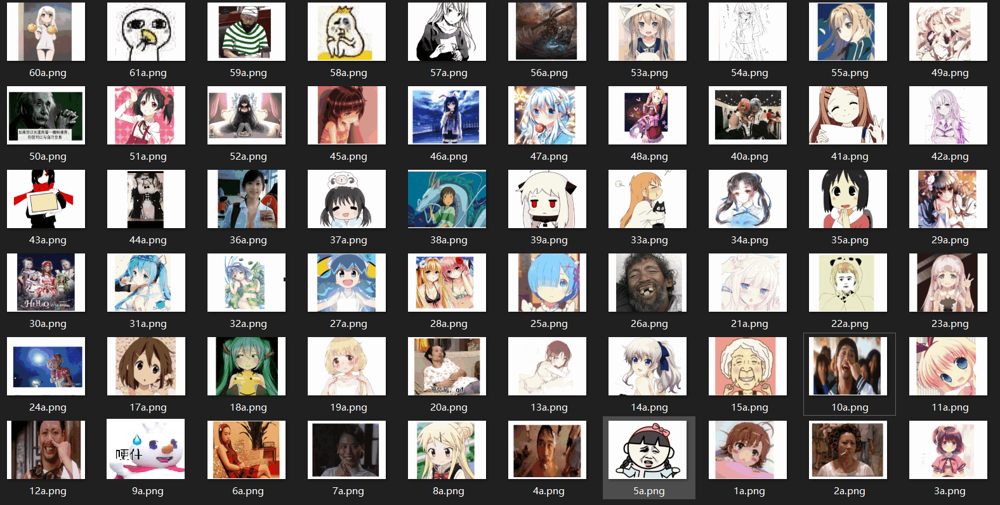

不受控制和无组织的信息是很难体现出自己的价值的，就好像在一堆照片里面找老婆一样。



（以上图片纯粹是迎合二次元肥宅，本人不是二次元&二次元爪巴！）

在这个信息爆炸的年代，信息的海量性、无序性和污染性与我们人类精力的有限性，以及利用资源时的选择性形成了尖锐的矛盾，给我们带来了很大的困扰。如何有效地**收集、存储可利用的信息**，把这些无序的信息**组织**起来，成为能够利用的知识和情报，并能根据需求**检索出来，加以利用**，成为我们的智慧，这是一件非常重要的事情。


> ## 想一想
>
> 人具有组织的本能，所以生活中，你怎么组织你的：
>
> - 书？纸质资料？或者电子资料（比如课件和电子书）？
> - 衣服？文具？食物？
> - 宿舍桌面？
> - 纸片人老婆？
>   

```
信息组织是对信息资源对象进行收集、加工、整合、存储使之有序化、系统化的过程。（周宁）
```


