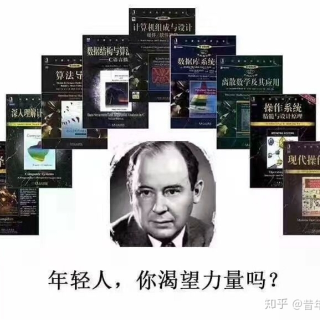
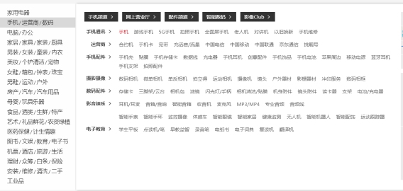
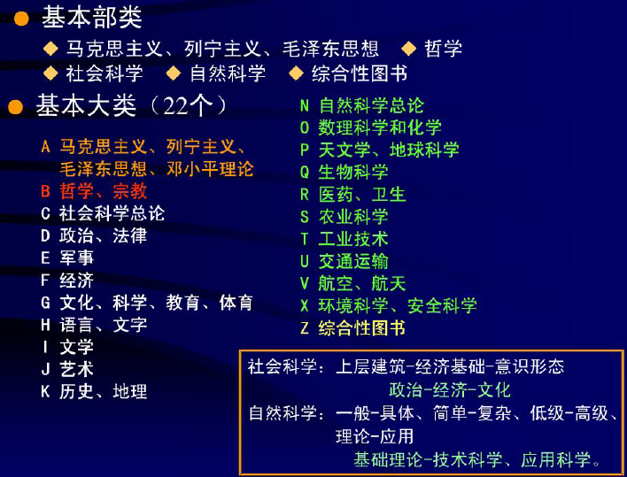
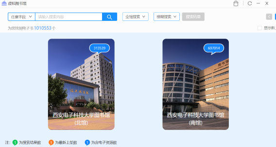

# 信息组织笔记

不受控制和无组织的信息是很难体现出自己的价值的，就好像在一堆照片里面找老婆一样。


（以上图片纯粹是迎合二次元肥宅，本人不是二次元&二次元爪巴！）

在这个信息爆炸的年代，信息的海量性、无序性和污染性与我们人类精力的有限性，以及利用资源时的选择性形成了尖锐的矛盾，给我们带来了很大的困扰。如何有效地**收集、存储可利用的信息**，把这些无序的信息**组织**起来，成为能够利用的知识和情报，并能根据需求**检索出来，加以利用**，成为我们的智慧，这是一件非常重要的事情。


> ## 想一想
>
> 人具有组织的本能，所以生活中，你怎么组织你的：
>
> - 书？纸质资料？或者电子资料（比如课件和电子书）？
> - 衣服？文具？食物？
> - 宿舍桌面？
> - 纸片人老婆？（二次元爪巴啊）
>   

```
信息组织是对信息资源对象进行收集、加工、整合、存储使之有序化、系统化的过程。（周宁）
```


## 如何开一家图书馆？

首先，你得有足够多的书。📕📗📘📒📙📔

在你收集到足够多的书之后，你会发现，如果没有足够科学的方法，要想按照需求找一本书就会变得非常困难，难度要远大于上面找老婆。

下边的这几本书，怎么分？



所以要设计一种分类方法，能够概括图书的内容与外表特征，从而便于组织和查找。

> ### 分类的两种方案
>
> 1. 体系分类法：对*概括文献信息内容及某些外表特征的概念*进行**逻辑分类和系统排列**构成的
>
>    
>
>    京东对于各种商品的分类方法就是一种体系分类法，比如华为手机就可以在“手机/运营商/数码-手机通讯-手机”中找到。
>
> 2. 组配分类法：一个复杂的主题概念可以用*若干个简单概念标识*的组配来表达
>
>    
>
>    爱奇艺对于各种影视作品的分类方法就是一种组配分类法，比如《战狼2》可以在“华语:动作:2017”中找到。

枯燥的知识不多说，接下来简单介绍一下国内图书馆通常使用的方法：中国图书馆分类法（下称“中图法”）

每一个分类法都有一个“骨架”，用来帮助用户迅速了解分类法的结构，并用于粗略的分类。中图法把所有的图书分为5个基本部类，基本部类下面又细分22个基本大类，每一个基本大类都用一个英文字母表示。



上面的一堆黑书中，除了离散数学在“O-数理科学与化学”中，其他的书都在“T-工业技术”中。这只是比较粗略的分类方法，日常分类没啥问题了。

可是如果是图书馆呢？



截止2021/6/28，西电图书馆总共有1010553种图书。用这种粗略的方法显然不可取。好在中图法并未止步于此。

# 未完待续，有时间再更……

