# 关于usnews\$曲阜师大的思考

在做信息计量学期末大作业的时候看到了一个颇具争议性的事件。 小组的研究对象是著名的USnews世界大学排名。 然而就是这个公认的四大较为权威的世界大学排名之一的USNews， 把一个所谓“考研强校”的曲阜师范大学，排在了中国内地大学数学学科排名第一名， 超过了传统认为的数学强校北大清华。

*在USNews发布的2021年度世界大学排行中， **曲阜师范大学**被排在中国数学学科榜单首位，世界排名也在第19。 该大学并非985、211，也并非双一流建设高校。在上一轮教育部学科评估中，其数学学科评级为B-，但却超越了 传统认为的数学学科强校北大、复旦、上交和清华。消息一出引发舆论热议，因为与公众认知差距过大。 曲阜师范大学2021 U.S.News数学学课指标明细显示，其国际学术声誉排名为第307名，地区学术声誉为第75名，论文出版 为第118名，国际合作论文排名为第356名等，这些相对排名靠后。但引用影响力（第1）、论文总被引数（第3）、前1%论 文数（第2）、比例（第1），前10%论文数（第4）、比例（第1）等排名都遥遥领先。*

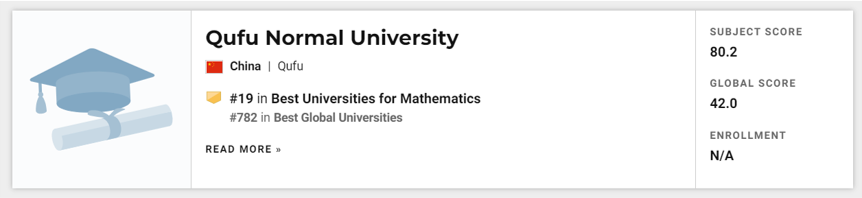

> ### 先来介绍一下USNews：
>
> 《美国新闻与世界报道》（U.S. News & World Report），简称 “美新周刊” ，是一本仅次于《时代》周刊和美国《新闻周刊》的美国第三大新闻杂志。它以专题报道美国国内外问题及美国官方人物访问记而显其特色。 U.S. News排名由《美国新闻与世界报道》（U.S. News & World Report）发布，其大学排名在美国多个机构对大学的排名中最有影响力。
>
> 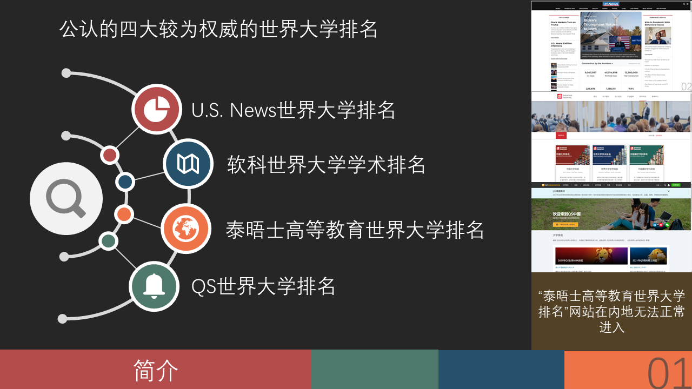
>
> U.S. News排名有八大分类，包括News Rankings（新闻）、Education Rankings（教育）、Health Rankings（健康）、Money Rankings（财经）、Travel Rankings（旅游）、Car Rankings（汽车）、Law Firms Rankings（律所）和Real Estate Rankings（不动产）。“教育”分类有六大板块，分为大学院校（Colleges）、研究生院（Grad Schools）、线上院校（Online Colleges）、世界大学（Global Universities）、社区院校（Community Colleges）和高级中学（High Schools）。 我们研究的是教育中的大学排名。
>
> 它的主页长这个样子：
>
> 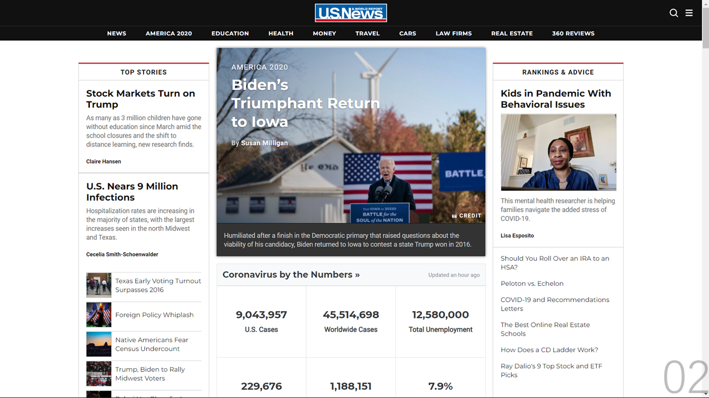
>
> > 注：完整的大作业可以在地址栏输入
> > https://samzhou-2019.github.io/info_management/usnews/S1.PNG
> > 将S后面的数字改为1至17即可。
> > GitHub下载图片较慢请见谅，有空我会把这个网站搬到Gitee里面。

由于USNews排名的学术成果排名依据是在Clarivate的WOS数据库，因此我决定从这里下手。 在WOS核心数据库中检索**机构**为**曲阜师范大学**，**北京大学**（在中国内地数学学科排行为第二）， **山东科技大学**（在中国内地数学学科排行第三，这个也很具有争议性）的所有论文，并筛选出 学科名中含有**"Mathematics"**的所有学科（理论数学Mathematics，应用数学Mathematics applied，跨学科应用Mathematics Interdisciplinary Applications） 分别检索到2119，4436，1542篇文献。（2020/11/6）

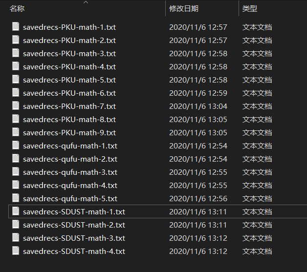

以纯文本方式导出“全记录+参考文献”进行导出（曲师大2119，北大4436，山东科大1542），扔进HistCite里面，按照LCS排序，画出排在前面的文献的引文关系图。 三所大学各画了LCS（local citation score，本地引用次数）前30，前50和前100的文献引文关系图。

> ### 曲阜师范大学
>
> 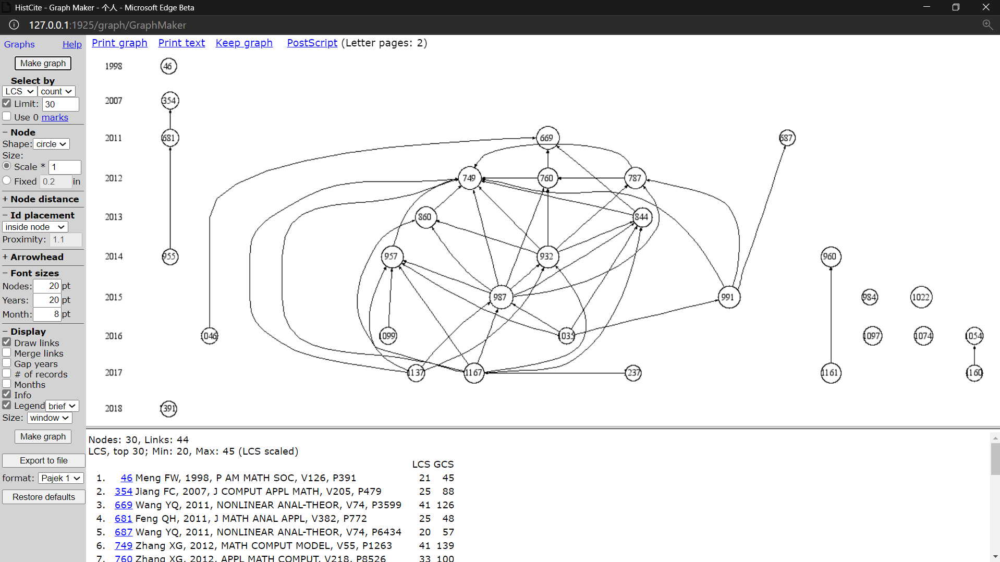
>
> 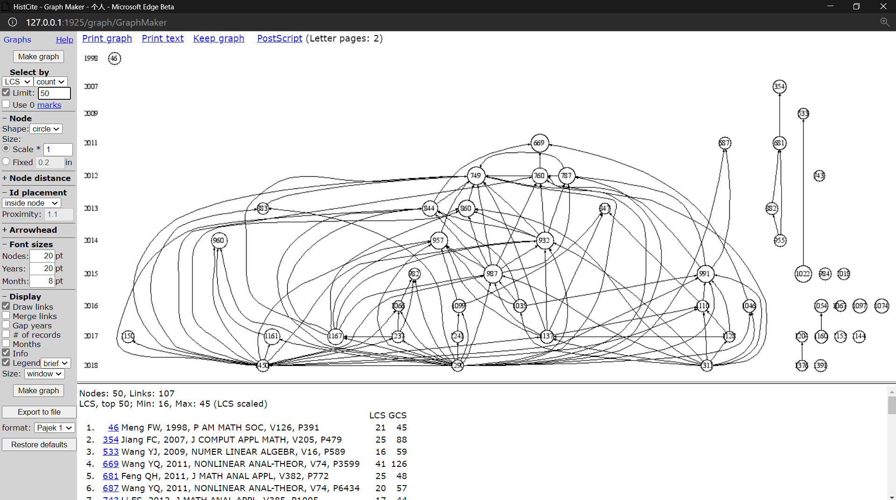
>
> 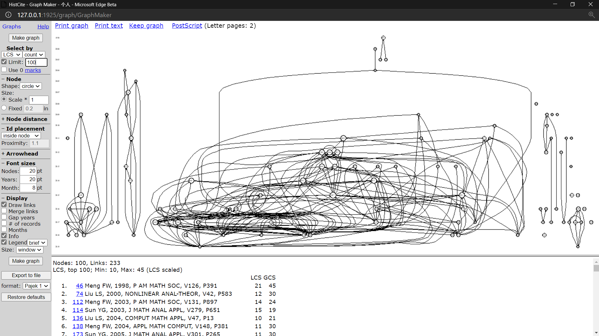

可以看出曲阜师大的论文明显分成几个小团体和中间的大团体。大团体之间引用非常频繁。具体查看可以发现，这些论文大多出自相同的几个人之中，且团体内部自引和互引现象极其严重。

> ### 山东科技大学
>
> 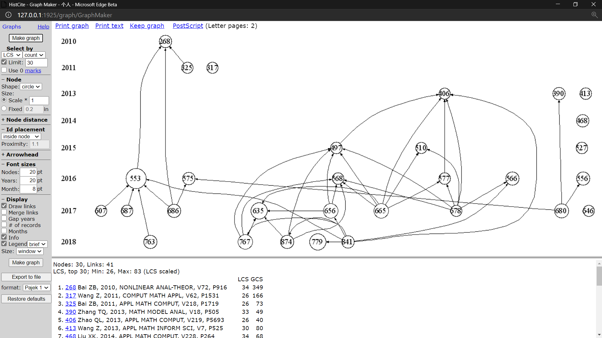
>
> 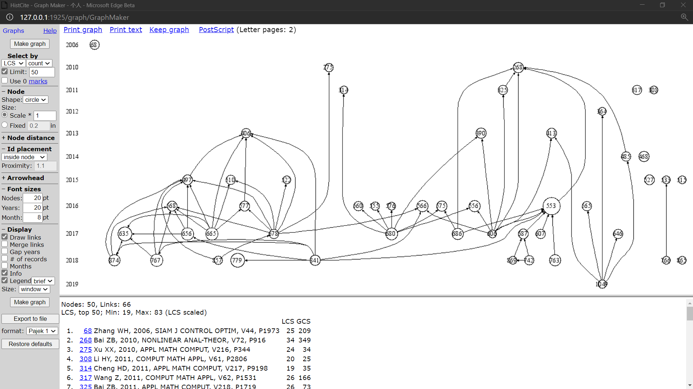
>
> 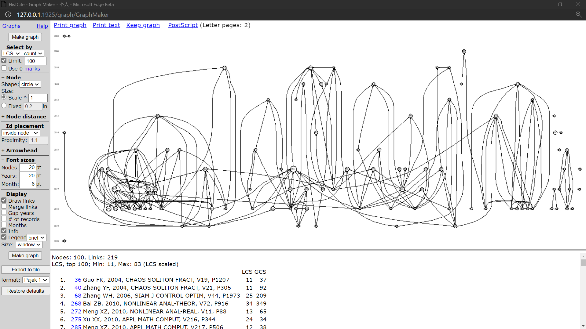

与曲阜师大相比，山东科大只出现了一个大团体，团体之间的自引和互引现象没有曲阜师大严重。

> ### 北京大学
>
> 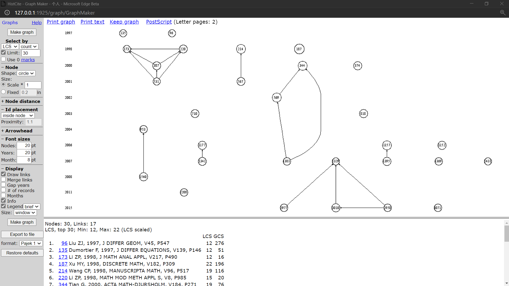
>
> 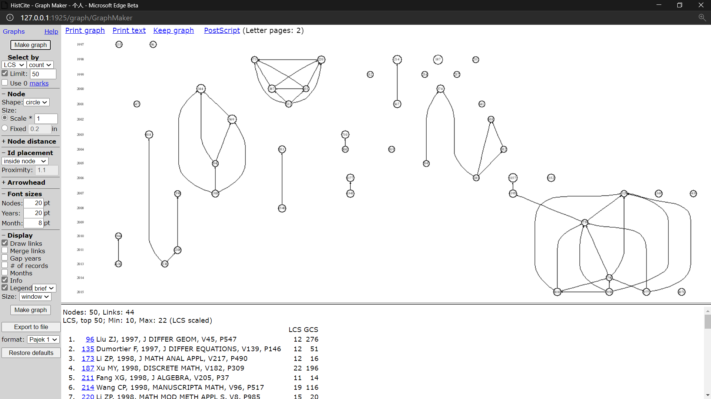
>
> 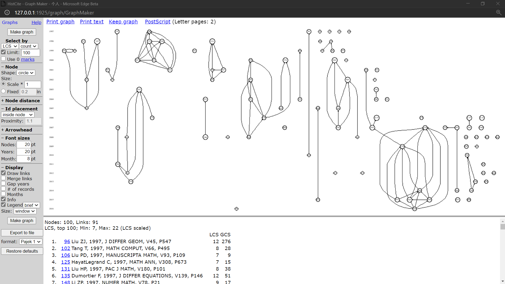

北大的引文关系图就比较稀疏，而且可以明显分出一些小团体。

粗略可以看出，曲阜师大和山东科大的自引和互引现象的确非常严重，但不知道这两所大学是否是故意为了提升这个排名而钻了空子。

> 为什么说他们可能是针对这个排名？因为这个排名还挺重要：
> 1.受欢迎。日访问量千万次，访问人数百万人
> 2.影响力。对美国高中生及中国留学生的大学申请具有指导作用。排名每增加一名，申请人数平均增加0.9%。
> 3.对高校的学科建设与战略规划有参考与指导作用
> 4.可靠性。数据来源权威性强（WoS），评价指标客观

与论文和引用相关的文献计量指标并未进一步细分发表在不同层次期刊上的论文的权重， 也没有区分本校与外校的引用。曲师大论文数量与中科院、北大、复旦相比还有差距，但“高被引论文数” 达到**120**篇，北京大学、复旦大学在该指标上的数据分别仅为 25、21。位于这一榜单第三名的山东科技大学，其“高被引论文数”更是达到**194** 篇，在排行榜中显得尤为突出。

曲师大的论文存在一定程度的自我引用情况。例如，一篇2010年发表的数学论文被46篇文章引用，有 **14**篇属于本校引用。 另外一篇2016年的文献中，33篇引用该论文的文献有**10**篇属于自引。

曲师大与山东科技大学的案例告诉我们，中国高校存在唯数字论的现象，也在一定程度上说明了usnews量化指标的粗糙与片面。