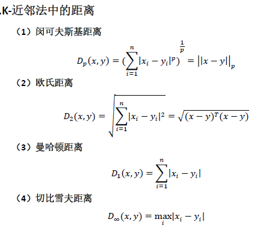
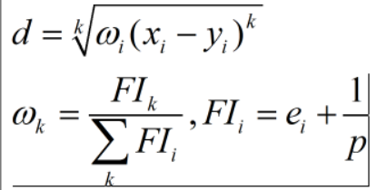

# R语言与机器学习

## R语言基础

> - R是一种为统计计算和绘图而生的语言和环境，它是一套开源的数据分析解决方案，由一个庞大且活跃的全球性研究型社区维护。
> - 多数商业统计软件价格不菲，而R是免费的！
> - R语言具备可扩展能力且拥有丰富的功能选项，帮助开发人员构建自己的工具及方法，从而顺利实现数据分析。
> - R可运行与多种平台之上，包括Windows、Unix和Mac OS X。这基本上意味着它可以运行于你所能拥有的任何计算机上。
> - 国际上R语言已然是专业数据分析领域的标准

R语言可以在[CRAN](https://cran.r-project.org/mirrors.html)上免费下载，推荐一个R语言的可视化IDE：[R Studio](http://www.rstudio.com/)(http://www.rstudio.com/)。

```R
print("Hello","world")
```

R语言可以通过在命令前加问号的方式调出帮助，如`?plot`。

### 包

**包**是R函数、数据、预编译代码以一种定义完善的格式组成的集合。计算机上存储包的目录称为库(library)。函数`.libPaths()`能够显示库所在的位置。函数`library()`则可以显示库中有哪些包或加载已安装的包。

R自带了一系列默认包，其他包可通过`install.packages("")`下载来进行安装。

### 赋值

R语言一般以<-或等号=进行赋值，通常可以自动识别数据类型。

```R
a<-1 #注释通常以井号开头
print(a)
a<-a*3
print(a)
b<-c("Hello","world")
print(b)
```

### 数据类型

```R
#<-为赋值语句
test<-2#只有一个整数的数值型向量
print(test)#输出数据对象
str(test)#查看数据对象的结构
#rm(test)#或remove(object)，删除数据对象
#命令窗口输入ls()查看所有数据对象
#is.数据类型(数据对象名)判断数据类型
print(is.numeric(test))
print(is(test))

test1<-12.34#实数，双精度型
test2<-"R-Object"#字符串('R-Object')
test3<-TRUE#逻辑布尔值
test4<-2+4i#复数
test5<-NaN#非数字
test6<-Inf#无穷大
test7<-NULL#空值
#以下为判断数据类型的函数
print(is.double(test1))
print(is.character(test2))
print(is.logical(test3))
print(is.complex(test4))
print(is.nan(test5))
print(is.infinite(test6))
print(is.null(test7))
#is函数会输出所有可能的数据类型
print(is(test1))
#typeof()只会输出基本的数据类型
print(typeof(test1))
#as.integer/numeric/double/character/logical/complex/...() 强制类型转换
print(test1<-as.complex(test1))
print(test3<-as.integer(test3))
```

### 向量

向量，相当于其他语言中的数组，通常用c()表示，其内部元素可以是实数、复数、字符、逻辑型数据。

```R
c<-c(1,2,3)
print(c)

name<-c("Alice","Mr.Brown","Xiao_Ming","Trump_China!")#字符串向量
print(name)
print(length(name))#元素的数量
str(name)#显示数据对象结构信息
```

#### 一些特殊向量

```R
grade<-rep("A",each=4)
stu_no<-seq(from=1,to=4,by=1)
present<-vector(length = 4)
```

> `rep(from:to,each=)`：从from到to依次重复each次
>
> 如：1:3,each=3 为 1 1 1 2 2 2 3 3 3
>
> `rep(from:to,times=)`：从from到to周期重复times次
>
> 如：1:3,times=3 为 1 2 3 1 2 3 1 2 3
>
> `seq(from=,to=,by=)`：从from到to间隔by生成向量
>
> 只写from和to即生成间隔为1的向量
>
> `seq(from=,to=,length=)`：从from到to长度为length生成向量
>
> `vector(length = n)`：创建长度为n的布尔值向量，初始值为FALSE

#### 向量元素的选择

```R
a<-seq(from=1,to=10)
print(a)
a[1]<--1#第一个元素
a[3:5]<-c(13,14,15)
a[c(6,8:10)]<-c(26,28,29,30)
#向量也可以作为引用元素的索引。这里指的是修改第6，8，9，10个元素
print(a)
p<-c(5,7,9)#创建位置向量，注意向量符号c不能丢
a[p]<-p
a[-c(p,6)]<-10#负号-表示指定除外的元素
print(a)
b<-c(TRUE,FALSE,TRUE,FALSE,TRUE,FALSE,FALSE,FALSE,TRUE,FALSE)
#创建逻辑性位置向量，取TRUE不取FALSE
print(a[b])
```

判断对象是否为向量：`is.vector()`；判断向量内各元素的数据类型：`mode()`

### 矩阵

利用矩阵可以描述二维数据，和向量相似，其内部元素可以是实数、复数、字符、逻辑型数据。矩阵使用两个下标来访问元素，A[i,j]表示矩阵A第i行、第j列的元素。

```R
a<-c(1,2,3)#向量默认为列向量
b<-c(4,5,6)
c<-c(7,8,9)
d<-cbind(a,b,c)#合并列向量，行合并函数为rbind()。(bind v.合并)
rownames(d)<-c("1st","2nd","3rd")#给各行赋行名，
#各列赋列名用colnames(matrix)<-c("name1",...)
print(d)
print(is.matrix(d))#判断是否为矩阵
print(dim(d))#输出矩阵的行数和列数
print(colnames(d))#输出各列名称，可加[位置向量]
print(rownames(d))#输出各行名称，可加[位置向量]
print(str(d))#输出对象结构
```

行列合并时各向量元素应相等或成整数倍数

```R
a<-c(1:9)
b<-c(1:3)
c<-c(3:7)
print(rbind(a,b))
#a    1    2    3    4    5    6    7    8    9
#b    1    2    3    1    2    3    1    2    3
print(cbind(a,b))#试一试这个会生成什么矩阵
#print(cbind(a,b,c))#c的元素个数不是a和b的倍数，会弹出警告。
```

向量和矩阵可以互相转换，转换函数为`as.matrix(向量)`和`as.vector(矩阵)`

接下来我们试着根据已知向量创建矩阵。

```R
a<-seq(from=1,to=72)
colnames<-c('1','2','3','4','5','6','7','8','9')
rownames<-c('a','b','c','d','e','f','g','h')
#根据已知向量创建矩阵
m<-matrix(a,#已知向量
nrow=8,#行数
ncol=9,#列数
byrow=FALSE,#是否按行进行排列
dimnames = list(rownames,colnames))#行名列名

print(m)
#  1  2  3  4  5  6  7  8  9
#a 1  9 17 25 33 41 49 57 65
#b 2 10 18 26 34 42 50 58 66
#c 3 11 19 27 35 43 51 59 67
#d 4 12 20 28 36 44 52 60 68
#e 5 13 21 29 37 45 53 61 69
#f 6 14 22 30 38 46 54 62 70
#g 7 15 23 31 39 47 55 63 71
#h 8 16 24 32 40 48 56 64 72

print(m[2,3])#输出某一个元素
print(m[c(2,3),c(3,7)])#输出指定行列元素
print(m[1:3,])#输出指定行元素
print(m[,c(5,7,8)])#输出指定列元素
print(head(m,5))#head(matrix,n)前n行元素 tail(matrix,n)后n行元素
#fix(m) 打开数据编辑器编辑数据
```

### 数据框

矩阵只能存储相同存储类型的变量，数据框可以存储不同存储类型的变量。

```R
name<-c("Alex","Bob","Tom","Alice")
age<-c(15,14,16,15)
class<-c(1,1,2,3)
gender<-c("male","male","male","female")
Student=data.frame(name=name,age=age,class=class,gender=gender)
#合并向量为数据框
print(Student)
print(names(Student))#输出表头
print(str(Student))#输出数据框结构信息
print(is.data.frame(Student))#判断是否为数据框
#fix(Student)#可视化界面修改数据
print(Student$name)#该语句与
print(Student[["name"]])#和
print(Student[[1]])#等价
```

#### 数据框的绑定

attach-detach和with可以绑定数据框。这一代码区域的所有操作均与该数据框相关，用于简化代码。

```R
#方法一：
attach(Student)
print(name)#在绑定数据框时，可以直接写域名，而无需指定数据框名
detach(Student)#解绑数据框。绑定区域内定义的变量在绑定区域外无法使用。
#方法二：
with(Student,{
    print(name)
})
```

### 因子

因子用来表示分类，可进行有序分类和无序分类

```R
a<-c("C","B","C","A","B")
b=as.factor(a)#向量转因子，as.vector()因子转向量
print(b)#此时仅有A，B，C三个因子
print(is.factor(b))
print(levels(b))#输出因子全部水平，按字母顺序排列
print(nlevels(b))#输出因子水平个数
print(str(b))#显示因子的信息
print(typeof(b))#因子的存储类型为整形Integer，但以字符串形式显示
```

#### 创建一个因子

```R
c<-factor(a,
order=TRUE,#是否为有序分类因子
levels=c("C","B","A"),#指定因子水平与取值的对应关系 3,2,1
labels=c("come_on","well","good")#因子水平标签
)
print(c)
```

### 数组

数组是由一个或多个二维表组成的多维结构。

```R
a<-seq(from=1,to=120)#创建一个2x3x4x5的数组
dim0<-c("x1","x2")
dim1<-c("a1","a2","a3")
dim2<-c("b1","b2","b3","b4")
dim3<-c("c1","c2","c3","c4","c5")
b<-array(a,#由向量组成数组
c(2,3,4,5),#数组大小
dimnames=list(dim0,dim1,dim2,dim3))#数组各行列名称
print(b)
print(is.array(b))
print(str(b))
print(names(b))
#fix(b)
```

### 列表

列表是对象的集合，可包含向量，矩阵，数组，数据框甚至列表等。

```R
x1<-matrix(1:15,3,5,TRUE)#创建一个包含向量，矩阵，数据框的列表
x2<-c(TRUE,FALSE,TRUE)
x3<-c("Alice","Alex","Amy","Alan","Amazon")
x4<-data.frame(num=c(1,2,3),name=c("Tom","Tim","Tam"))
x<-list(x0=b,x1=x1,x2=x2,x3=x3,x4=x4)
print(x)
print(names(x))
print(str(x))
```

### 绘图

```R
win.graph() #创建并打开一个绘图窗口
print(dev.list()) #输出绘图窗口列表，一般窗口1为默认绘图窗口，不可关闭
#dev.off(2)#按编号关闭绘图窗口
print(dev.cur()) #正在使用的绘图窗口
dev.set(2) #使用某绘图窗口
pdf("plot.pdf") #创建文档
#png("D:/test.png")#也可以创建png等图片文件
dev.set(3)
pie(c(5, 6, 7)) #饼图
plot(c(1:10), c(11:20), col = rainbow(7), pch = 11, lty = 2)
#散点图，col为颜色，rainbow(n)为n种颜色循环，pch为点的形状，lty为线的形状
barplot(c(1,2,3),c(5,6,7))#条形图
dev.off(3)
```

### 文件与其它

```R
a=scan(file = "test.txt",#读取文本文件数据并存为向量
what = double(), #数据格式转换
skip = 1)#跳过前一行
print(a)

b=read.table(file = "test.txt",#读取文本文件数据并存为数据框
header=TRUE,#第一行是否为表头（FALSE即为具体数据）
)#sep="" 分隔符 stringsAsFactors=TRUE 字符串转换为因子，默认为TRUE
print(b)
```

> R的循环语法为for-in，for (item in list) {function}
>
> R的输入函数为scan，如`a<-scan()`，可以读取从终端输入的数据
>
> R可以使用SQL语句来读写数据，包名为sqldf，例：
>
> ```R
> data<-chickwts    #自带数据：不同饮食种类对小鸡生长速度的影响
> library(sqldf)
> result=sqldf("select weight
>              from data
>              where feed=\"soybean\"")
> print(result)
> ```

## 数据挖掘笔记

### 1.决策树

Infogain(ID3)  Gainratio(C4.5, C5.0)  Gini(CART)

#### 1.1 Gini

倾向于选择多值变量，类别较多时分类困难。


### 2.组合预测模型

建立并综合参考多个预测模型，减少预测误差

1. 袋装技术：将多个不稳定的预测模型组成一个稳定模型
2. 随机森林
3. 推进技术：将多个稳定的弱模型结合成更有效的模型

评估指标：偏差和方差。**偏差大通常方差小，偏差小通常方差大**

#### 2.1 袋装技术

1. 建模阶段：样本集S，样本数量为n，从S中有放回随机抽取k次n个样本形成k个模型Ti
2. 预测阶段：为样本投票，少数服从多数。哪个类别“得票”最多，就预测为哪个类别。
3. 评价阶段：基于袋外观测（OOB）样本归入带外观测的概率约为1/e=0.368
   1. 依次输入所有样本
   2. 如果某样本在Ti中是OOB，则Ti可以为样本投票
   3. 少数服从多数
   4. 计算Ti的误差

k的决定：通常k=√p，p为变量个数。k越大，误差（偏差，各决策树的OOB预测误差）越小，方差（各决策树之间的相关性）越大

优点：降低方差以提高精确度；对【参数对样本数较为敏感（即“不稳定”）】的样本集作用显著；简单易懂
缺点：总有部分样本参与建模，结果偏乐观；模型不直观

> 实现袋装技术的R函数为ipred包中的bagging函数，它的基本书写格式为：
> `bagging(输出变量名~输入变量名,data=数据框名,nbagg=k,coob=TRUE,control=参数对象名)`
> 其中`coob=TRUE`表示基于袋外观测计算误差，`nbagg`用于指定袋装过程的自举次数。

#### 2.2 随机森林

1. 建模阶段：从S中随机抽取k阶样本形成Θi（Forest-RI），或随机抽取L个样本，生成[-1,1]均匀分布的L个随机数αi形成vi，vi=Σ αi · xi抽取k次产生k个线性组合样本形成Θi（Forest-RC,适用于小样本），生成的树充分生长，不剪技。
2. 预测阶段：为样本投票，少数服从多数
3. 评价阶段：基于OOB
   1. M个树，每个树计算预测误差ei
   2. 随机打乱第i个变量的顺序，再计算误差eij
   3. cij=ei-eij，cj=Σcij/M。cj表明第j个变量的重要性。

优点：运算效率高。仅依赖两个参数：k和样本数n，在不删除变量的条件下，可计算上千个样本，且效果好。

建立随机森林的R函数是randomForest包中的randomForest函数。
`randomForest(输出变量名~输入变量名,data=数据框名,mtry=k,ntre=M,importance =TRUE)`
`mtry`用于指定决策树各节点的输入变量个数k，`ntree`用于指定随机森林包包含M棵决策树，`importance = TRUE` 表示计算输入变量对输出变量重要性的测度值。

#### 2.3 推进技术

降低偏差， 通过样本权重和树的权重。

步骤与袋装技术类似，但

1. 第一次建模时，S中每个观测有相同的权重。在建模阶段抽祥时，各样本的权重较高越容易被抽中。

2. 每次建树后需修改样本权重。

   > 样本权重的修改：
   >
   > 正确样本：w(j,i+1)=w(j,i)\*(ei/(1-ei))。错误样本不变。
   >
   > 然后再归一化。

3. 投票时按树的权重进行。

   > 数的权重：log₂((1-ei)/ei) 或 1/2*log₂((1-ei)/ei) 

优点：无需过多参数，方法灵活，降低偏差。
缺点：不适用于过于复杂（过拟合）或过于弱（效果差）的模型

> 实现推进技术的R函数为adabag包中的boosting函数，它的基本书写格式为：
> `Boosting(输出变量名~输入变量名,data=数据框名,mfinal=重复次数,boos =TRUE, coeilearn=模型权重调整方法,control=参数对象名)`
> 其中`coob=TRUE`表示每次自举过程均调整各观测进入训练样本集的权重，`mfinal`用于指定袋装过程的自举次数。

### 3.K近邻



#### “K”的决定

bigger K：分界平滑，噪声小， 忽略局部结构，方差小偏差大
smaller K：分界不平滑， 噪声大，体现局部结构，易过拟合，方差大偏差小

| 决定K的方法 | 留1法<br />1 VS Ohers，重复n次                               | 旁置法<br />train VS test                                    |
| ----------- | ------------------------------------------------------------ | ------------------------------------------------------------ |
| 适用        | 小样本                                                       | 大样本                                                       |
| 原因        | 大样本成本高，<br />类别分布不均时效果差，<br />小样本学习充分 | 小样本学习充分性欠佳，<br />划分训练集和测试集的随机性误差会体现出来 |

#### 计算步骤

1. 数据标准化（xi’=(xi-min)/(max-min)或xi’=(xi-avg(x))/σ）
2. 选取未知分类的的点，计算相邻的点的距离
3. 选出距离最近的k个点
4. 根据k点的类标号决定未知点的分类

**1-近邻算法的预测错误概率不会高于普通贝叶斯预测方法错误率的2倍。**

#### 数据处理的方式

|        | 普通             | 加权                                                        |
| ------ | ---------------- | ----------------------------------------------------------- |
| 数值   | 原值或标准化     | xi’=xi/σ                                                    |
| 顺序型 | [0,1]均分取值    | 虚拟变量<br />(1, 1, …, 1)  (-1, 1, …, 1) … (-1, -1, …, -1) |
| 分类型 | 0：相同；1：不同 | 虚拟变量<br />(1, 0, …, 0) (0, 1, …, 0) … (0, 0, …, 1)      |

> R实现K－近邻法的函数是class包中的 knn函数。knn函数的基本书写格式为：
> `knn(train＝训练样本集,test＝测试样本集,cl=含出变量,k＝近邻个数K,prob=TRUE/FALSE,use.all = TRUE/FAISE)`
> 其中，TRUE表示函数返回值是概率值，FALSE表示类别值。回归预测中，prob应设置为 FALSE,分类预测中，prob可设置为TRUE; use. all TRUE表示当有多个等距离的近邻而使得实际近邻个数大于K时，所有近邻均参与预测 FAlSE 表示在多个等距离的近邻中随机抽取近邻，确保实际近邻个数等于K 。
> knn函数中的距离定义为欧氏距离。
> R中有关于1-近邻法的专用函数knnl，基本书写格式为：
> `Knn1(train=训练样本集,teast=测试样本集,cl=输出变量)`
> 此外，R中有将K-近邻法和留一法“打包”成一体的knn.cv，基本书写格式为：
> `Knn.cv(train=训练样本集,cl=输出变量,k=近邻个数K)`

#### 变量重要性加权



其中e为剔除变量之后的预测误差，p为变量个数

#### 观测相似性加权

1. 数据处理（见上方“数据处理的方式”表格中“加权”一列）

2. 计算闵科夫斯基距离。顺序型，分类型在作差求k次方后还需除以虚拟变量个数
3. 确定k+1个近邻，并确定D(X(i),X(0))=d(X(i),X(0))/d(X(k+1),X(0))
4. 利用核函数求K[D(X(i),X(0))]即各观测权重Wi
5. 按分类将权重相加并比较

高斯核：K=(1/2π)e^(-d²/2)