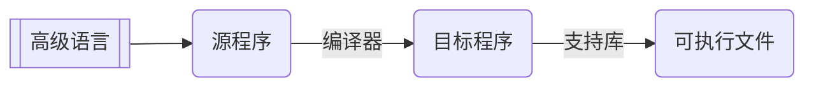
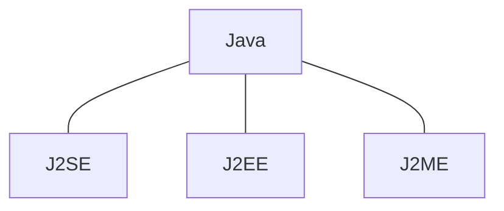
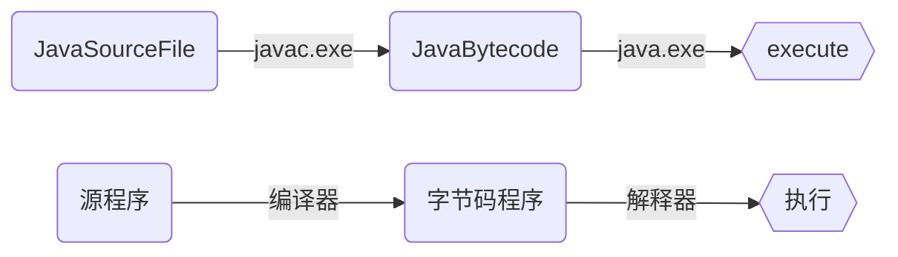
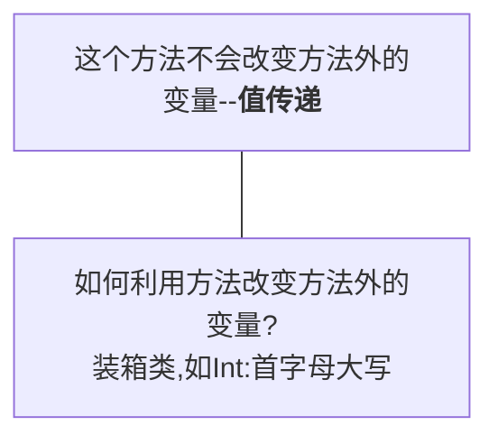
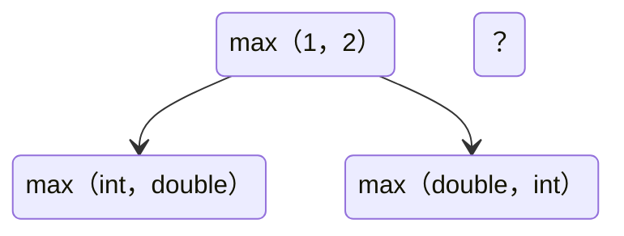
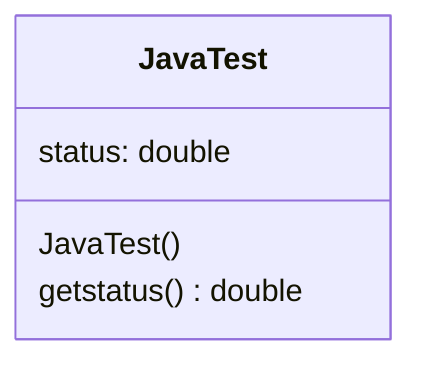
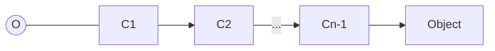
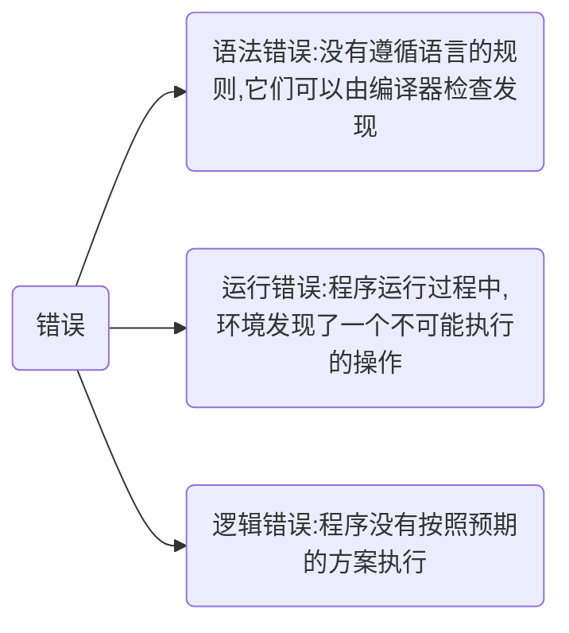

```java
// 学面向对象编程又不发对象可怎么学
// 自己new啊
System.gc(); // new的对象迟早要释放
// 在理👍

static final class object(){};
// 对象都静态了，不会动不好玩
// 你喜欢会动的？
// 你不对劲

private final object(){};// 我有找对象的方法，但是我没有对象。
public final class object(){};// 国家统一分配对象，还包邮
// 详细说说（哭了）
// 还共享对象？

// ————信管系关于Java的“学术”交流《Java：面向的程序设计》
```

# Java 学习笔记

整理于~~2020-10-12~~ 2020-12-17
~~面向对象的程序设计——看着对象写代码~~


[TOC]





---

# 一、Java概述

## Java是什么

Java是一种编程语言，更是一种平台

+ JVM: Java Virtual Machine

  Java虚拟机，运行Java程序，屏蔽底层差异

+ JRE: Java Runtime Environment

  Java运行环境，包含了运行Java程序所必要的组件

+ JDK: Java Development Kit

  Java开发工具包，除了JRE外还包含开发、调试Java程序所需要的各种工具、库等

<b style="color:red">特点：简单、高效、安全、健壮、面向对象的、分布式的、解释型的、体系结构中立的、可移植的、多线程的、动态的</b>

<b style="color:orange">面向对象三个基本特征：封装、继承、多态</b>

## Java程序的大致结构

```java
public class Helloworld {//定义一个类
    public static void main(String[] args) {//main:程序入口
        System.out.println("Hello World");//输出一个字符串
        Student sam = new Student();//类的实例化（对象）
        sam.greetings("Sam");//对象使用方法
    }
}

class Student {
    public void greetings(String s) {//类中的一个方法，形参为一个字符串
        System.out.println("Hello, " + s);
    }
}
```

### Java文件剖析

1. 注释

   ```java
   //单行注释
   /*多行注释
   和C语言类似
   */
   ```

2. 保留字

   ```java
   abstract,continue,for,new,switch,assert,default,goto,package,synchronized,boolean,do,if,private,this,break,double,implements,protected,throw,byte,else,import,public,throws,case,enum,instanceof,return,transient,catch,extends,int,short,try,char,final,interface,static,void,class,finally,long,strictfp,volatile,const,float,native,super,while
   // ⚠对编译器具有特殊意义，在程序中不能用作其他目的
   ```

3. 修饰符

   ```java
   public static private final abstract protected
   ```

4. 语句，表示一个或一系列操作，以==分号==结束

5. 块，由==花括号==括起来

6. 类，是对象的模板和蓝图

   ```java
   public class ClassName{
       /*class的命名规则：
       1. 同文件名对应
       2. 首字母大写
       3. 名词形式
       */
   }
   ```

7. 方法

### main 方法

main方法是Java程序的入口

```java
public static void main (String[] args){}
    //程序的入口，解释器通过调用main方法执行应用程序
```

`String[] avgs` 又被称为“命令行参数”。当该Java程序被命令行或其他Java程序调用时起作用。

```bash
$ java className arg0 arg1 ... argn
# arg 通常为字符串
```

```java
className.main(arg0,arg1,...,argn)
```


## 如何运行Java

```bash
$ javac Helloworld.java # 编译，无输出说明编译成功，生成Helloworld.class文件
$ java Helloworld # 执行，⚠注意不加.class后缀
Hello World
Hello, Sam
$ javap Helloworld.class # 反编译，将字节码反编译为源码
```



---

# 二、基本数据类型与基本操作

## 标识符

 * 由字符、数字、下划线_和美元符号$构成的字符串，不能用数字开头。
 * 可以有任何的长度，==⚠但不能是保留字或布尔值**`true,false`**、空值**`null`**==。

## 变量

```java
// 声明变量
int test;
// 变量初始化
test = 1;
// 合并为一条语句
int test = 1;
// 强制类型转换
int test = (int) 5.123;
// float建议用(int)，double建议用(long)
```

### 变量类型

| **类型**   | **范围**                                | **存储大小**        |
| ---------- | --------------------------------------- | ------------------- |
| **byte**   | -2^7^~2^7^-1                            | **8-bit signed**    |
| **short**  | -2^15^~2^15^-1                          | **16-bit signed**   |
| **int**    | -2^31^~2^31^-1                          | **32-bit signed**   |
| **long**   | -2^63^~2^63^-1                          | **64-bit signed**   |
| **float**  | 表示范围：绝对值为1.4E-45~3.4028235E38  | **32-bit IEEE 754** |
| **double** | 绝对值为4.9E-324~1.7976931348623157E308 | **64-bit IEEE 754** |

Java中整型的范围与机器无关（C/C++：有关）

```java
// 布尔变量 boolean 与整型、字符型不能相互转换
boolean b = true;// true false
// !b = false

// 整数变量 int byte short long
byte a = 123;
System.out.println((int) a + x);// (类型) 强制转换数据类型
// 低精度的值赋给高精度变量时必须进行强制转换
short s = 12;
int x = 100, y = 0123/* 八进制 */, z = 0xABC123/* 十六进制 */;
long l = 23456L;// 结尾加大写字母“L”

// 字符型变量 char
// 用单引号'括起来，双引号括起来的是字符串
char c = 'a', d = '我';// 0~65536 Unicode
// 转义：\n(换行) \b(退格) \t(制表) \r(回车) \' \" \\ \u0001(Unicode)
System.out.println(c + d);// 输出的是Unicode数值
System.out.println((int) c);

// 浮点数变量 float double
float f = 3.14159f, e = 1e-5F;// 结尾加大写或小写字母F或f
// 保留八位有效数字
double g = 3.1415926535897d, h = 1e-90;// 结尾加大写小写字母D或d，可省略
// 可用科学计数法表示浮点数，用e或者E表示指数
// 保留十六位有效数字
// 精度从低到高：byte short char int long float double
// 从低到高转换无需显式强制转换，从高到低必须使用强制转换
double a = 1;
int i = (int)3.5;

// 数制转换
System.out.println(Integer.toHexString(2020));// 将数字转换成十六进制字符串
System.out.println(Integer.toBinaryString(2020));// 将数字转换成二进制字符串
System.out.println(Integer.toOctalString(2020));// 将数字转换成八进制字符串
System.out.println(Integer.toString(2020));// 将数字转换成十进制字符串
```

## 常量

```java
// 常量只允许被赋值一次，值一旦设定便不允许改变
// 使用final来表示常量，习惯上常量名用大写字母和下划线表示
final double FINAL_TEST = 1.0;
```

---

# 三、控制语句

## 运算符

按运算优先级排列：
后置自增减运算符 v++, v--
前置自增减运算符 ++v, --v 正负标识符 +v, -v 按位和逻辑非运算符 ~, !
基本运算符 *, /, %; +, -
移位运算符 <<, >>（带符号）, >>>（无符号）
比较运算符 >, <, >=, <=, instanceof; ==, !=
按位运算符 &, ^, | (按位与，异或，或)
逻辑与或运算符 &&, ||
赋值运算符 =, +=, -=, *=, /=, %=, &=, ^=, !=, <<=, >>=, >>>=

与（&&）、或（||）的短路运算法则：一旦前表达式为false（与）/true（或），则直接得结果false（与）/true（或），而不运行后面的操作。
&，|也可进行逻辑运算，但==⚠不适用==短路运算法则，因此不建议使用。

```java
/* 15   00000000 00000000 00000000 00001111
   23   00000000 00000000 00000000 00010111
 &= 7   00000000 00000000 00000000 00000111
 |=31   00000000 00000000 00000000 00011111
~15=-16 11111111 11111111 11111111 11110000
 ^=24   00000000 00000000 00000000 00011000*/
```

| 例子                                     | 值         | 含义                                                         |
| ---------------------------------------- | ---------- | ------------------------------------------------------------ |
| int  x = 5/2;                            | 2          | 整数除法                                                     |
| double  y = 5/2;                         | 2.0        | 先做整数除法，然后再将结果转换为double                       |
| double  z = 5.0/2;<br>double  u = 5/2.0; | 2.5<br>2.5 | 由于分子、分母至少有一个是浮点数，因此做浮点除法             |
| int  w = (int)(5.0/2)                    | 2          | 先做浮点除法，然后取整。**取整的算法就是，直接截去小数部分**（注意：不是四舍五入） |

---

# 四、条件语句与循环语句

以下语句与C相似

```java
if (condition) 
{ } 
else if (condition) 
{ } 
...
else 
{ }
```

```java
switch(i){// i可以是char，byte，short或int值 
    case value1: statement1;break; // value表达式必须是常量
    ...
    default: statementd;break; 
}
```

```java
i=(condition)?a:b// condition为true时执行a，false时执行b
```

```java
for (initialization;condition;action)// 初始条件和迭代语句可以有多个，用逗号隔开
// for(;;)即while(true)
{ }// ⚠注意：括号外没有分号
```

```java
while (boolean) {}// 注意：无分号
```

```java
do{} 
while (boolean);// ⚠注意结尾一定要有分号
```

```java
break; 
continue;
```

以下语句与python中的for item in items相似

```java
char c[] = { 'X', 'I', 'D', 'I', 'A', 'N' };
for (char x : c)// x必须未定义
System.out.println(x);
```

+ **在循环中不要比较浮点数相等，因为浮点数是近似的，可能会导致不正确的循环次数和不准确的结果。**
+ **在循环体内定义的变量只能在循环体内使用。**

## 程序输入与输出

```java
import java.util.Scanner;
Scanner reader = new Scanner(System.in);
String s = reader.next();// 输入字符串，空格为分隔符
// .nextBoolean()
// .nextInt()
// .nextByte()
// .nextShort()
// .nextLong()
// .nextFloat()
// .nextDouble
System.out.print(s);
// System.out.println：输出数据后换行
// System.out.print：输出数据后不换行
// System.out.printf：按C语言形式输出数据 %b %c %d %f %e %s
// System.format：用法同System.out.printf，创建格式化的字符串
reader.close();// ⚠输入完毕后及时关闭输入实例
```

---

# 五、方法

```java
/*定义方法*/
public /*修饰词*/ int /*返回值类型*/ method /*方法名*/ (int x /*形参*/) /*方法头*/{
    /*方法体*/
    /*在方法体内定义的变量称为局部变量，只限于在方法体内使用*/
    return x;/*返回值，方法体中可以提前return*/
}
/*调用方法*/
int m = method(a /*实参*/);
double time = System.currentTimeMillis();// ⌚获得当前时间
```



## 重载

重载：一个类中可以有多个相同名字的变量/方法，但类型/参数必须不同。重载方法调用参数时必须对应。

```java
public int max (int x, int y){}
public double max (int x, int y){} // ❌ 仅改变返回值类型，不是重载
public int max (int n, int m){} // ❌ 仅改变形参命名，不是重载
public int max (int x, int y, int z){} // ✅
public double max (double x, double y){} // ✅
```

子类中名称相同的变量和方法会隐藏/重写父类的同名变量和方法。如需使用父类变量或方法则需使用super.。

重载示例：

```java
void calculate(double C) {
    double result = C * C * PI;
    System.out.println("Object:Circle");
    this.printFunction(result);// this表示由类实例化的当前对象
}

void calculate(double A, double B) {
    double result = A * B;
    System.out.println("Object:Square");
    this.printFunction(result);
}

void calculate(double A, double B, double C) {
    double cosB = (A * A + C * C - B * B) / (2 * A * C);
    double result = 0.5 * A * C * Math.sqrt(1 - cosB * cosB);
    System.out.println("Object:Triangle");
    this.printFunction(result);
}
```

### 歧义调用

一个方法的调用可能会与多个重载的方法匹配，此时会产生编译错误。如：



解决方法：`max(1, (double)2)`或`max((double)1, 2)`

## 方法示例

### 弹出一个可视化对话框

```java
import javax.swing.JOptionPane;

javax.swing.JOptionPane.showMessageDialog(null,//对话框配置，默认为null
/*showInputDialog为输入对话框*/            "Hello, world",//对话框主体内容
/*返回输入的字符串*/                       "welcome",//对话框标题
javax.swing.JOptionPane.INFORMATION_MESSAGE);//对话框类型，包括ERROR_MESSAGE, INFORMATION_MESSAGE, WARNING_MESSAGE, _MESSAGE, PLAIN_MESSAGE
```

```java
final double PI=3.14159;
Double radium=Double.parseDouble(JOptionPane.showInputDialog("Please input radium:"));//弹出一个输入对话框
//Double.parseDouble指字符串转换为浮点数
JOptionPane.showMessageDialog(null, "Area="+Double.toString(radium*radium*PI),
                              "Result", JOptionPane.INFORMATION_MESSAGE);
```

例子：弹出到前时间对话框

```java
import java.util.Date;
import javax.swing.JOptionPane;

public class current_time {
    public static void main(String avgs[]) {
        long millis = System.currentTimeMillis();
        /* Java的System类中，有currentTimeMillis()方法， 
        返回从GMT 1970年1月1日0点开始到当前时刻的毫秒数 */
        long second = millis / 1000;
        long minute = second / 60;
        long hour = minute / 60;

        int real_second = (int) second % 60;
        int real_minute = (int) minute % 60;
        int real_hour = (int) hour % 24;
        if (real_hour >= 16)
            real_hour = real_hour - 16;
        else
            real_hour = real_hour + 8;

        String timeString = String.format("%02d:%02d:%02d BJT\n", 
                                          real_hour, real_minute, real_second);

        Date date = new Date();// java.util.Date包

        JOptionPane.showMessageDialog(null, timeString + date.toString(), 
                                      "Current Time\n",
                JOptionPane.INFORMATION_MESSAGE);
    }
}
```

### Math类中的方法

```java
//类常量：
public static double PI
public static double E
//三角函数
public static double sin(double a)//如：Math.sin(Math.PI/2) 得到1.0
public static double cos(double a)//如：Math.cos(Math.PI/2) 得到 0.0
public static double tan(double a)
public static double acos(double a)
public static double asin(double a)
public static double atan(double a)
//指数函数
public static double exp(double a)//e^a
public static double log(double a)//ln(a)
public static double log10(double a)//log10(a)
public static double pow(double a, double b)//a^b
public static double sqrt(double a)//√a
//取整
public static double ceil(double a)//得到向上与a最接近的整数
public static double floor(double a)//得到向下与a最接近的整数
public static double rint(double a)//得到与a最接近的整数。如果到两个整数的距离相等，则返回其中的奇数
public static int round(float a)//四舍五入：(int)Math.floor(a + 0.5)
public static double round(double a)//四舍五入：(long)Math.floor(x + 0.5)
//min/max/abs
public static double min(double a, double b)
public static float min(float a, float b)
public static long min(long a, long b)
public static int min(int a, int b)/**/
public static double max(double a, double b)
public static float max(float a, float b)
public static long max(long a, long b)
public static int max(int a, int b)/**/
public static double abs(double a)
public static float abs(float a)
public static long abs(long a)
public static int abs(int a)
//random
public static double random()//得到 [0.0, 1.0) 之间的一个随机数
```

## 包

把多个类放在一起成为包，可以：

1. 避免命名冲突
2. 便于发布软件
3. 保护类

包是分层次的，并且可以有包含关系。类必须隶属于某个包中。
缺省包：某个类的包名称为空，类似于根目录上的类。
包名称使用倒写的Internet域名，如`cn.edu.xidian.ems`（https://ems.xidian.edu.cn）

在类中定义包名

```java
package cn.edu.xidian.ems;
```

编译与运行

```bash
$ javac cn/edu/xidian/ems/Helloworld.java # 注意目录结构分割符为斜杠
$ java -classpath "D:\java" cn.edu.xidian.ems.Helloworld
# 以包名称的方式写目录。classpath被称为类路径，字符串格式，是包的位置
```

导入其他包中的类

```java
import javax.swing.JOptionPane;
import javax.swing.*; // 导入这个包里面的所有类
```

---

# 六、数组

数组是可以表示一组具有相同数据类型的结构。

```java
double[] student = new double[20]; // 不推荐使用 double student[]
/*数组一旦生成，其长度不可改变。可以用*/student.length;/*来得到数组大小：20*/
// ⚠length不是方法，不能写作.length()
```

数组创建缺省值

| 类型   | byte | short | int  | long | float | double | boolean | char   | Object（如String） |
| ------ | ---- | ----- | ---- | ---- | ----- | ------ | ------- | ------ | ------------------ |
| 缺省值 | 0x00 | 0     | 0    | 0    | 0     | 0      | false   | \u0000 | null               |

## 定义、创建、初始化数组

```java
double[] price = new double[]{3.50, 15.35, 4.65};// 注意不能指定数组长度
double[] price = {3.50, 15.35, 4.65};
/* 不能单独给数组名赋值，错误用法：
double[] price;
price = {3.50, 15.35, 4.65};
但是可以为各个元素单独赋值*/
char[] ch = { 'a', 'b', 'c', 'd' };
int[] integar = { 1, 2, 3 };
```

### 一维数组

```java
byte[] a;// 声明数组时方括号内不允许指定数组长度
a = new byte[5];// 为数组分配元素
a[0] = 0x8a;
/*	a	[0]		[1]		[2]		[3]		[4]
 *		0x8a	0x00	0x00	0x00	0x00 */
```

### 二维数组

```java
float[][] b;
b = new float[3][4];// 也可以写作float[][] b=new float[3][4];
```

### 长度不同的二维数组

```java
float[][] c;
c = new float[2][];
c[0] = new float[5];
c[1] = new float[3];
System.out.println(c.length);// array.length数组长度
// c.length = 2, c[0].length = 5
```

## 数组的引用

```java
// 字符型数组引用数组名会输出整个数组
char[] ch = { 'c', 'h', 'a', 'r', 'a', 'c', 't', 'e', 'r' };
System.out.println(c);
// 数字型数组引用数组名会输出地址
int[] a = { 1, 2, 3 };
System.out.println(a);
// 将数组和字符串并置可以输出数组地址
System.out.println("c:" + c);
// ⚠方法引用数组并修改形参数组的元素，会影响到方法外的实参数组的元素
public static void test (int[] a1, char[] a2){
    a1[0] = 3;// 这一步会影响到方法外的数组
    a2 = new int[]{'x', 'i', ' ', 'a', 'n'};// 这一步则不会
}
// 方法也可以返回数组
public static int[] test(int[] list){
    return list;
}
test(new int[]{ 3, 4, 5 });// 没有赋给任何变量的数组被称为匿名数组
```

## 数组的复制

```java
int[] a = { 1, 2, 3 };
int[] b = { 4, 5 };
b = a;// 利用数组名直接赋值，只会改变地址而不是数组本身
```

```mermaid
graph TD
	AA[a]-->A("{1,2,3}")
	BB[b]-->B("{4,5}")
	a=b
	AAA[a]-->C("{4,5}")
	BBB[b]-->C
	AAAA("{1,2,3}")-->GC{{垃圾回收}}
```

有关垃圾回收的内容见【对象的复制】。

1. 使用循环

   ```java
   int[] b = new int[a.length];
   for(int i=0; i<a.length; i++) b[i] = a[i];
   ```

2. `System.arrayCopy`(原数组，原数组起始位置，目标数组，目标数组起始位置，复制元素数量)

   ```java
   System.arrayCopy(a,0,b,0,3);
   ```

---

# 七、对象和类

面向对象的程序设计：使用对象进行程序设计。
对象：现实世界中可以明确表示的一个整体。
每个对象都有状态【变量】和行为【方法】。
类：定义同一类型对象的结构体。

```java
class className{// 修饰词 class 类名
    int classVariable;//定义变量
    // 没有static修饰词的变量一般只属于特定对象，不共享
    private char privateVariable;// 私有变量,类外不能直接使用
    final static float finalStaticVariable;
    //由static修饰的变量和方法由定义的所有对象共享
	//由final修饰的变量和方法不能修改
    void classFunction(){// 定义方法
        System.out.println(classVariable);
    }
}

className classObj = new Classname();// 引用类的基础上实例化一个对象
classObj.classVariable;// 调用对象的数据
classObj.classFunction();// 调用对象的方法
```

类内数据域的缺省值：类内的数据域在未赋值前的缺省值同数组缺省值。
==⚠注意：方法中的局部变量没有缺省值，若直接使用则会报错==。

## UML类图

UML：统一建模语言

```java
class JavaTest{
    double status = 1.0;// 变量：状态
    JavaTest(){}// 构造方法
    double getStatus(){return status;}// 方法：行为
}
```




|                 类名<br />（斜体表示抽象类）                 |
| :----------------------------------------------------------: |
|                       数据域：数据类型                       |
| 构造方法()<br />方法名(参数名：参数类型)：返回值参数类型<br />(+表示public，-表示private，#表示protected，下划线表示static，斜体表示abstract) |

## 构造方法

构造方法：用类创建对象的方法。

```java
class plus{
    int x;
    // 若未定义构造方法则采用无参数的默认构造方法，如plus()
    plus(int a,int b){// 构造方法无类型，可定义参数
        x=a+b;
    }// ⚠构造方法与所在的类必须具有相同的名字
    plus(){}// ⚠若定义了一个有参的构造方法，则无参构造方法默认不会生成，需要额外定义
}
plus test=new plus(20,30);//构造方法的作用体现在这里
```

对象的复制：和数组的复制一样，利用对象名直接赋值给另一个对象，只会改变地址而不是对象本身。垃圾回收机制同样也会起作用。

## 垃圾回收机制（GC）

当没有指针指向某一内存空间时，JVM会自动释放该空间。

```java
System.gc();
```

## 类的实例

### 日期

`java.util.Date`
		``+Date()   ``                                              构造方法：创建当前时间的Date对象
		`+Date(elapseTime:long)`                    构造方法：参数为从Epoch Time开始的毫秒数
		`+toString():String`                           返回一个字符串表示的时间
		`+getTime():long`                                返回Epoch Time开始的毫秒数
		`+setTime(elapseTime:long):void`      设置新的时间

### 随机数

```java
import java.util.Random;

Random ran = new Random();// 无种子的构造方法
System.out.println(ran.nextBoolean());
// ran.nextInt() .nextLong() .nextFloat() .nextDouble() .setSeed(seed)
// ran.nextInt(int bound) 产生0到bound参数(不包括)的随机数

// 计算机产生的实际上是一组以种子为依据生成的伪随机数，相同种子所生成的随机数列相同
// 常见做法：设定不同的随机数种子以生成尽可能随机的数
Random rand = new Random(System.currentTimeMillis());// 有种子的构造方法
```

### ArrayList

`java.util.ArrayList`类用于储存不限个数的对象

| +ArrayList()                     | 构造函数                                |
| -------------------------------- | --------------------------------------- |
| +add(o:Object):void              | 添加一个对象到ArrayList的尾部           |
| +add(index:int, o:Object):void   | 添加一个对象到ArrayList的指定位置       |
| +clear():void                    | 清除内容                                |
| +contains(o:Object):boolean      | 判断ArrayList中是否包含指定的对象       |
| +get(index:int):Object           | 获取指定位置的对象                      |
| +indexOf(o:Object):int           | 获取指定对象在ArrayList中的索引         |
| +isEmpty():boolean               | ArrayList是否为空                       |
| +lastIndexOf(o:Object):int       | 获取指定对象在ArrayList中最后出现的位置 |
| +remove(o:Object):boolean        | 在ArrayList中，移除指定的对象           |
| +remove(index:int):Object        | 在ArrayList中，移除指定位置的对象       |
| +size():int                      | ArrayList当前包含对象的数目             |
| +set(index:int, o:Object):Object | 设置指定位置上的对象                    |

### 包装类

每一个数据类型都有包装类，以Character为例

```java
Character.isDigit(char);//判断是否为数字
Character.isISOControl(char);//判断是否为Unicode控制字符
Character.isAlphabetic(char);//判断是否为字母
Character.isDefined(char);//判断是否为Unicode定义的字符
Character.isLetter(char);//判断是否为字母
Character.isWhitespace(char);//判断是否为空白字符
Character.isUpperCase(char);//判断是否为大写字母
Character.isLowerCase(char);//判断是否为小写字母
Character.isLetterOrDigit(char);//判断是否为数字或字母
Character.toUpperCase(char);//转换为大写字母
Character.toLowerCase(char);//转换为小写字母
Character.toString(char);//转换为字符串
Character.toChars(char);//转换为字符
Character.compare(char1,char2);//字符比较
Character ch = 'e';
ch.equals('d');//判断字符是否相等
ch.charValue();//转换为字符
ch.compareTo(char);//字符比较
```

| 基本数据类型 | char      | boolean | byte | short | int     | long | float | double |
| ------------ | --------- | ------- | ---- | ----- | ------- | ---- | ----- | ------ |
| 对应的包装类 | Character | Boolean | Byte | Short | Integer | Long | Float | Double |

### Object类

| 方法       | 功能                                                         |
| ---------- | ------------------------------------------------------------ |
| equals()   | 比较两个对象的引用（地址）是否相同，同“==”<br />通常需要覆盖这个方法来实现自己的逻辑 |
| hashCode() | 返回该对象的hash码                                           |
| clone()    | 复制一个对象                                                 |
| getClass() | 返回关于该对象的类的信息                                     |

## 修饰词

1. static

   实例方法：没有static的变量和方法。在定义对象时一般绑定于该对象，不与其他对象共享，通常用**对象名.变量名**和**对象名.方法名**调用。
   静态方法：由static修饰的变量和方法。由定义的所有对象共享，可以直接利用**类名.变量名**和**类名.方法名**调用，不建议使用对象名调用。

   示例：java.lang.Math类【这里的方法都是静态方法，因此无需实例化即可使用。】

2. 可见性修饰符：public/private/protected

   + 缺省：**同包内的任意类**均可访问
   + public：**任意包的任意类**均可访问
   + private：只能在**本类**访问

   | *访问权限符*（修饰变量和方法） | *访问权限类型*         | *变量和方法权限对比*       | *子类继承权限对比*   |                 |
   | ------------------------------ | ---------------------- | -------------------------- | -------------------- | --------------- |
   | private                        | 私有变量和私有方法     | 类外不能使用               | 不能继承             | 最严格  ”私有“  |
   | 不加访问权限符                 | 友好变量和友好方法     | ==同包的类==可以使用       | ==同包的类==可以继承 | 默认情况 ”同包“ |
   | protected                      | 受保护变量和受保护方法 | ==同包的类和子类==可以使用 | ==任何类==均可以继承 | 最复杂          |
   | public                         | 共有变量和共有方法     | 类内外均可使用             | ==任何类==均可以继承 | 最开放  ”任意“  |

   - public类（共有类）可以在==任意==类创建对象
   - 权限符缺省的类（友好类）只能在==同包==的类里面创建对象
   - private和protected不能修饰类
   - ⚠访问修饰符不能用在==局部变量==上
   

   |               | **本类** | **本包** | **子类** | **其他包** |
   | ------------- | :------: | :------: | :------: | :--------: |
   | **public**    |    ✅     |    ✅     |    ✅     |     ✅      |
   | **protected** |    ✅     |    ✅     |    ✅     |     ❌      |
   | **default**   |    ✅     |    ✅     |    ❌     |     ❌      |
   | **private**   |    ✅     |    ❌     |    ❌     |     ❌      |

1. final

   final可以修饰类，方法和变量。

   - final类不可被继承，即不能有子类
   - final方法不能由子类覆盖
   - final变量即常量，定义后不可被修改


## 封装

推荐将变量设置为私有变量，使用方法读取和修改对象数据(get&set)。
优点：保护数据，使得类更容易维护。

```java
private int age;

public int getAge() {//访问器（读）
    return age;
}

public void setAge(int age) {//修改器（写）
    this.age = age;
}
```

变量无法更改的类被称为永久类，创建的对象被称为永久对象。
⚠*私有变量没有set修改器*的类不一定是永久类。

方法在将对象作为自己的参数时，引用的是地址而不是值，因此在方法内对形参对象进行改变会造成方法外实参对象的改变。但利用形参对象重新实例化则不会对实参对象造成影响。（与数组的引用类似【方法引用数组并修改形参数组的元素，会影响到方法外的实参数组的元素】。）

## 枚举类

枚举类可以在类内定义，也可以在类外，还可以单独形成一个枚举类文件。定义时需要使用关键词enum。

```java
enum Animal {
    Dog, Cat, Fish;//枚举类中的常量【枚举常量】
}
```

枚举可以作为数据类型，定义**枚举变量**。它的值是枚举类的一个**枚举常量**。

```java
Animal A1 = Animal.Cat;
System.out.println(A1+"s eat fish.");//Cats eat fish.
```

枚举变量的方法：

1. 类名.values() 返回枚举类的所有值 
2. 类名.valueOf("枚举常量字符串") 将字符串转换为枚举常量 
   如Animal.valueOf("Cat")返回Cat
3. 枚举变量.ordinal() 返回枚举变量的值（枚举常量）所对应的序号 
   如Cat.ordinal()返回1

```java
//可以利用for循环语句或switch语句调用
for(Animal ani : Animal.values()){
    System.out.println(String.valueOf(ani.ordinal())+". "+ani+" is a kind of animal.");
    switch(ani){
        case Cat:System.out.println("They eat fish.");break;
        case Dog:System.out.println("They eat meat.");break;
        case Fish:System.out.println("They eat shrimps.");break;
    }
}
```

这一段程序会输出

> 0. Dog is a kind of animal.
> They eat meat.
> 1. Cat is a kind of animal.
> They eat fish.
> 2. Fish is a kind of animal.
> They eat shrimps.

---

# 八、字符串和文件

## 字符串

```java
String message = new String("I drink coffee.");//正式初始化方法，注意S大写
String messageNew = "I drink tea";//快速格式化方法
messageNew = "Coffee对身体不好。";//字符串是一个对象，内容不可改变。尝试重新赋值只会创建一个新的字符串对象，而原有的字符串对象则被垃圾回收机制清理。

System.out.println(messageNew.length());
//在Java中字符串由Unicode储存，中英文字符长度均为1。
//注意⚠这里的length是一个方法，因此结尾有括号。（数组的length是一个变量，因此不需要括号）
System.out.println(messageNew.charAt(8));//提取字符串中的某个元素
//索引为0至长度减1。⚠注意不能用中括号messageNew[8]
```

### 字符串的修改

```java
//字符串连接：concat和+加号，可以连用concat和加号
System.out.println(message.concat(messageNew).concat("\nOK, I drink tea."));
System.out.println(messageNew+"\n"+message);

//提取子串
System.out.println(messageNew.substring(6,9));//从a到b不包括b
System.out.println(messageNew.substring(6));//从a到末尾

//比较字符串内容
System.out.println(message.equals(messageNew));//内容是否相等，返回布尔值
//⚠ message==messageNew比较的是字符串变量存储的地址。
System.out.println(message.compareTo(messageNew));//按照Unicode值比较字符串，返回一个值：=0说明相等，>0说明前者大于后者，<0说明后者大于前者
//.compareToIgnoreCase() 不区分大小写进行比较

//修改字符串
System.out.println(message.toLowerCase());//转换为小写字母
System.out.println(message.toUpperCase());//转换为大写字母
//trim()：去掉头尾的空格
System.out.println(message.replace("coffee", "wine"));
//replace(oldChar, newChar)：将字符串中的 oldChar 用 newChar 来代替
//oldCHar 也可以用正则表达式
//replaceAll 全部替换 replaceFirst 从左到右查找，只替换第一个

//查找字符或子串
//indexOf(char/String,index)：从前向后查找
//lastIndexOf(char/String,index)：从后向前查找
//这两个方法中index可省略。若指定index，则从index指定的位置开始查找
//如果找不到，则返回 -1
System.out.println(message.indexOf("coffee"));

//将字符和数字转换为字符串
System.out.println("咖啡的价格是￥"+String.valueOf(50));

//根据正则表达式拆分字符串为字符串数组
System.out.println(message.split(" ")[2]+"\n"+message.split(" ")[1]);
```

### 字符串缓冲区

```java
//字符缓冲区
StringBuffer buff = new StringBuffer(40);
//构造时默认长度为16（无参构造），可定义长度。此时为空缓冲区
//参数为字符串时，生成字符串+长度16空的缓冲区
buff.append("I love Sundae");//追加内容，可追加基本数据类型，字符串及缓冲区
buff.append(", a kind of ice cream").append(", very much.");//支持连写
String str = buff.toString();//转为字符串
System.out.println(str);

//字符串与数值的转换
Integer.parseInt("123"); //123 String->int
//Double.parseDouble String->Double
String.valueOf(123); //"123" int->String
```

## 文件与输入输出

```java
import java.io.File;
import java.io.IOException;
import java.io.PrintWriter;
import java.util.Scanner;

public class file_test {
    public static void main(String[] avgs) throws IOException {
        File f = new File("test.txt");
        if (!f.exists()) {//判断文件是否存在
            //f.mkdir();//创建文件夹(目录)
            f.createNewFile();//创建文件
            /*File
            exists()    文件或目录是否存在
            canRead()    是否可读
            canWrite()    是否可写
            isDirectory()    是否为目录
            isFile()    是否为文件
            isAbsolute()    本File对象是否采用绝对路径来创建的
            isHidden()    是否为隐藏文件
            getAbsolutePath()    得到绝对路径
            getCanonicalPath()    得到规范的绝对路径
            getName()    得到文件/目录名
            getPath()    得到路径
            getParent()    得到父目录的路径名
            lastModified()    最后修改时间
            delete()    删除
            renameTo(File)    重命名
            deleteOnExit()   JVM关闭时删除文件
            setReadOnly()    设置只读
            setReadable(boolean)    设置是否可读
            setWritable(boolean)    设置是否可写
            setExecutable(boolean)    设置是否可执行
            */
        }
        PrintWriter pw = new PrintWriter("test.txt");
        pw.print("test");//写入数据，可使用print,printf,println
        pw.close();//及时关闭写入对象
        Scanner sn = new Scanner(f);
        String a=sn.nextLine();//读取下一行
        /**Scanner
         * next()    读入字符串
         * hasNext()    boolean,是否有输入
         * nextByte(),nextInt(),nextShort(),
         * nextDouble(),nextFloat(),nextLong()    读入相应类型数据
         * useDelimiter(String)    设置分隔符
         */
        sn.close();//及时关闭读取对象
        System.out.println(a);
    }
}
```

---

# 九、继承和多态

## 继承和子类

继承：使用现有类的所有功能，在无需重新编写原有的类的基础上，对这些功能进行扩展。
通过继承创建的类被称为“子类”或“派生类”；被继承的类被称为“父类”、“超类”或“基类”。
继承是一个从一般到特殊的过程。

==`class 子类 extends 父类`==
每个子类只能有一个父类。父类与子类之间为树形结构，根节点为`java.lang.Object`。

```java
class UniversityStudent extends Student
```

1. 子类可以从父类继承属性和方法，也可以

   + 添加自己特有的属性、方法
   + 覆盖父类的方法

2. 子类不能继承父类的构造方法，只能被显式或隐式调用。

   + 使用关键字super可以显式调用父类的构造方法

   + 若没有构造方法被显式调用，父类的无参构造方法就将被自动、隐式调用
> ==⚠此时若父类没有无参构造方法，程序将无法编译==。解决方法：
>
> 1. 给父类添加无参构造方法
> 2. 在子类显式调用父类定义的构造方法
>
> 构造方法链：利用子类实例化对象时会沿着继承链调用所有父类的构造方法

3. 不同包的子类不能继承父类的友好变量和友好方法，但可以继承父类的public/private变量和public/private方法。
   protected受保护变量和方法—子类继承的更多说明：

   + 当在其他类O用某类A创建对象N时，如O与A在同一个包中，则N可以使用A自己创建的受保护变量和方法

   + 当在其他类O用某类A创建对象N且A为B的子类时，如O与B在同一个包中，则N可以使用B创建的受保护变量和方法

4. 动态绑定：对象调用一个方法，JVM将从定义该对象的类出发，沿着继承链查找该方法的实现，直至找到为止【匹配方法头】，调用该实现【绑定方法】。



> + 使用引用变量调用实例方法时，变量所引用对象的实际类在==运行==时决定使用该方法的哪个实现。
>
> + 访问数据域或静态方法时，引用变量所声明的类型在==编译==时决定使用哪个数据域或静态方法。
>
>   这是调用实例方法与访问数据域或静态方法的主要不同。

### super

super指向该类的父类，用于：

1. 调用父类的构造方法

   ```java
   super();//无参构造方法
   super(int i);//有参构造方法
   ```

2. 调用父类方法

   ```java
   super.func(int i, char ch);
   ```

> ==⚠注意==
>
> 1. 在子类中直接使用父类构造方法的名字会引起语法错误
>
> 2. super调用构造方法的语句必须放在子类构造方法的第一句
>
>    ```java
>    public test(){
>        super();
>        int num = 0;
>    }//✅
>    public test(){
>        int num = 0;
>        super();
>    }//❌
>    ```

## 覆盖

子类对父类**可访问的实例方法**进行修改。

⚠“可访问”意味着父类的**private方法**不能被覆盖；**static方法和父类数据域**可以被继承，但也不能被覆盖。重新定义**这两种方法及数据域**，会使得**父类的方法和数据域**被隐藏，但是仍然存在且与子类的方法和数据域相互独立。可以使用super来调用**父类数据域和static方法**。
⚠覆盖不能降低方法的访问性。访问性从小到大为：==private->default->protected->public==

```java
class student{
    public double getGrade(long id){...}
}
class collegeStu{
    public double getGrade(long id){...}//override 💡覆盖不修改形参变量，仅改变方法体
    public double getGrade(short id){...}//overload
}
```

`⚠覆盖.equals(重写) == true`

## 多态

子类重写父类的方法，可以各自行使自己的功能行为。这种性质被称为多态性（Polym）。

父类 a = new 子类，即“子类是父类"。创建的对象a被称为上转型对象。
如 `Animal a = new Dog();`即“狗是动物”。（这一句包含了隐式强制转换，子类转父类）

上转型对象只继承父类的变量、方法和==子类重写的方法==，**不能继承子类新增的变量和方法，也不能赋值给子类实例化的对象（除非显式强制转换为子类对象，如 `a = (Dog) a;`）**。但相比于用子类直接创建的对象，上转型对象可以继承==父类的隐藏变量==。

多态的作用：把不同的子类对象都看成父类，可以屏蔽不同子类对象的差异，使得代码通用化。

```java
public class polym {

    public static void main(String[] avgs) {
        // 多态
        Animal P;
        P = new Cat();
        P.run();// 上转型对象继承子类重写的方法
        P = new Bird();
        P.run();
    }
}

class Animal {
    void run() {
    }
}

class Cat extends Animal {
    void run() {// 子类重写父类的方法
        System.out.println("Run with four legs.");
    }
}

class Bird extends Animal {
    void run() {
        System.out.println("Run with two claws.");
    }
}
```

### instanceof

用法：对象 instanceof 类名
如果对象是由类及其父类定义的，则返回true，否则返回false

```java
System.out.println(test instanceof Student);
```

---

# 十、抽象和接口

## 抽象

abstract类（抽象类）：用abstract修饰的类。

> + 用abstract修饰，可以有抽象方法，也可以有普通方法。
> + 不能用new创建该类的对象（实例化）【即便没有抽象方法也不能实例化对象】，但可以创建上转型对象，也可以定义构造方法（在子类中调用）。
> + 只能在 被非抽象子类重写 时实现其功能，可以利用多态性。
> + 非抽象类的子类可以是抽象类。
> + 抽象类可以用作数据类型，如用来定义数组。

抽象方法：用abstract修饰的方法。

> + 只能声明【只有方法头】，没有方法体，不能实现任何功能。
> + 一般用来被子类覆盖，因此不能用final和static修饰。
> + 定义抽象方法的类==⚠必须为抽象类==。
> + 抽象类的非抽象子类中，所有的抽象方法都==⚠必须覆盖。如果不能覆盖所有的抽象方法，这个类就必须是抽象的。
> + 子类可以覆盖父类的非抽象方法，并定义其为抽象方法。此时该子类必须是抽象类。

```java
public class abstract_test {
    public static void main(String[] avgs) {
        Shape a = new Circle();
        System.out.println(a.area(5));
        // 抽象类可以创建上转型对象，并且可以使用被非抽象子类重覆盖的方法（多态）
        a.call();
    }
}

abstract class Shape {
    // abstract类（抽象类）
    abstract double area(double a);// 抽象方法
    
    void call() {
        System.out.println("A shape.");
    }// 非抽象方法
}

class Circle extends Shape {
    double area(double a) {
        return a * a * Math.PI;
    }

    void call() {
        System.out.println("A circle.");
    }
}

// 抽象类可以用作数据类型，如用来定义数组
Shape[] shapes = new Shapes[10];
```

## 接口

与抽象类相似，但只包含==⚠常量和抽象方法==。

> + 接口被认为是一种特殊的类。和抽象类类似，也不能用new实例化，但可以创建上转型对象。
> + 没有共同的根。（所有的类有一个共同的根：Object类）
> + 接口也可以用作数据类型，与抽象类相似。
> + 如果一个类扩展了接口，这个类就类似于这个接口的子类。与继承不同，一个类可以同时扩展多个接口，用逗号隔开。
>   但是如果一个类扩展的多个接口之间有信息冲突，就会引起错误。（例如，两个相同的常量有不同的值，两个方法有相同的头标志，但返回类型不同）
> + 单重或多重继承中，父子关系较强的使用子类继承，较弱的使用接口。

```java
public interface Comparable{
    public static final double pi = 3.1415926;
    //所有的变量都必须是public static final，因此这三个修饰符可以省略
    public abstract int CompareTo();
    //所有的方法必须是public abstract实例方法，因此这两个修饰符可以省略
}
```

子类在扩展接口时，必须重写接口的方法。

```java
public class Circle extends Shape implements Comparable{...}
```

|        | 变量                                        | 构造方法                                                     | 方法                                    |
| ------ | ------------------------------------------- | ------------------------------------------------------------ | --------------------------------------- |
| 抽象类 | 无限制                                      | 子类通过构造方法链调用构造方法，抽象类不能用new操作符实例化。 | 无限制                                  |
| 接口   | 所有的变量必须是public static final，即常量 | 没有构造方法，接口不能使用new操作符实例化。                  | 所有的方法必须是public abstract实例方法 |

# 十一、错误与异常



## 异常

Error：内部系统错误，是由JVM抛出并在Error类中描述的，一般很少发生。
Exception：异常，由程序和外部环境引起的错误，能够通过程序捕获和处理。

免检异常：RuntimeExcption，Error及其子类
大多数情况下免检异常反应程序设计中不可重获的逻辑错误。不建议捕获或声明。

必检异常：所有其他异常。
编译器会强制程序员检查并处理它们。

### 声明异常

每个方法都需要声明（throws）它可能抛出的==必检异常==类型。
可以声明多个异常，用逗号分开。也可以声明自定义异常。

```java
public void readFile(String filename) throws FileNotFoundException{...}
```

### 抛出异常

程序检查到一个异常后，创建一个异常类型的对象并抛出（throw）它。

```java
throw new FileNotFoundException();// 方法1
FileNotFoundException ex = new FileNotFoundException();throw ex;// 方法2
```

一个方法出现异常时，如果想让该方法的调用者处理异常，则应当创建一个异常对象并抛出该异常。
如果能在发生异常的方法中处理异常就不需要抛出异常。

### 捕获异常

当必须处理不可预料的错误时使用。

```java
try{
// 正常逻辑
}
catch (/*异常*/Exception ex){
 // 可以处理一个异常
}
   catch (/*异常*/Exception2 ex2){
 // 也可以处理多个异常
}
   ...
finally {
 // 无论是否捕获异常，这部分代码都会执行
   }
```

> 如果声明了一个必检异常，如
>
> ```java
> void err() throws IOException {}
> ```
>
> 就必须**在try-catch块中捕获**
> 
> ```java
> void p(){
>      try {err();}
>     catch(IOException ex) {//异常处理}
> }
> ```
>
> 或者**在调用它的方法中再次声明该异常**
>
> ```java
> void p() throws IOException {err();}
> ```
>
### 自定义异常类

创建自定义异常类：继承Exception的子类

```java
public class MyException extends Exception {}
```

返回首页：https://samzhou-2019.github.io/