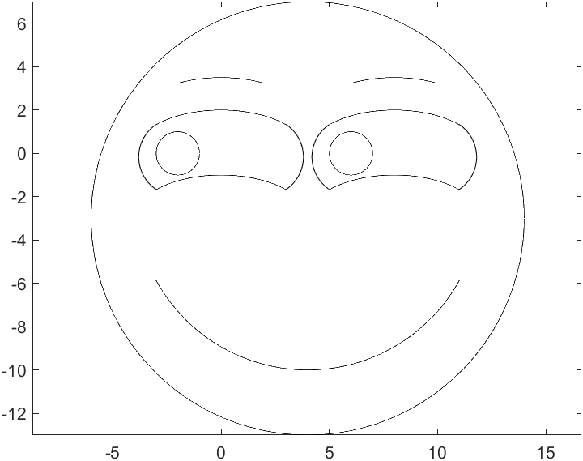

# 用matlab画一个滑稽

去年寒假自学matlab的时候画了一个滑稽，有点粗糙 🤣

```matlab
a=[-3:0.01:3];%左眼x坐标
b=2*sqrt(1-a.^2/16);%左眼y坐标
c=[-3:0.01:-1];%左圆x坐标
d=sqrt(1-(c+2).^2);%左圆上半圆y坐标
e=-sqrt(1-(c+2).^2);%左圆下半圆y坐标
f=[-2:0.01:2];%左眼x坐标
g=2*sqrt(1-f.^2/16);%左眼y坐标
plot(a,b,'k',a,b-3,'k',c,d,'k',c,e,'k',f,g+1.5,'k'),axis equal;
hold on;
a=[5:0.01:11];%右眼x坐标
b=2*sqrt(1-(a-8).^2/16);%右眼y坐标
c=[5:0.01:7];%右圆x坐标
d=sqrt(1-(c-6).^2);%右圆上半圆y坐标
e=-sqrt(1-(c-6).^2);%右圆下半圆y坐标
f=[6:0.01:10];%左眼x坐标
g=2*sqrt(1-(f-8).^2/16);%左眼y坐标
plot(a,b,'k',a,b-3,'k',c,d,'k',c,e,'k',f,g+1.5,'k'),axis equal;
hold on;
a=[-3.81:0.01:-3];
b=sqrt(3.25-(a+2).^2)-0.1666;
c=-sqrt(3.25-(a+2).^2)-0.1666;
plot(a,b,'k',a,c,'k');
hold on;%左眼左眼角
a=[3:0.01:3.81];
b=sqrt(3.25-(a-2).^2)-0.1666;
c=-sqrt(3.25-(a-2).^2)-0.1666;
plot(a,b,'k',a,c,'k');
hold on;%左眼右眼角
a=[4.19:0.01:5];
b=sqrt(3.25-(a-6).^2)-0.1666;
c=-sqrt(3.25-(a-6).^2)-0.1666;
plot(a,b,'k',a,c,'k');
hold on;%右眼左眼角
a=[11:0.01:11.81];
b=sqrt(3.25-(a-10).^2)-0.1666;
c=-sqrt(3.25-(a-10).^2)-0.1666;
plot(a,b,'k',a,c,'k');
hold on;%右眼右眼角
a=[-6:0.01:14];
b=sqrt(100-(a-4).^2)-3;
c=-sqrt(100-(a-4).^2)-3;
plot(a,b,'k',a,c,'k');%大圆
hold on;
a=[-3:0.01:11];
b=-sqrt(64-(a-4).^2)-2;
plot(a,b,'k');%嘴型
```

效果图是这个样子：

