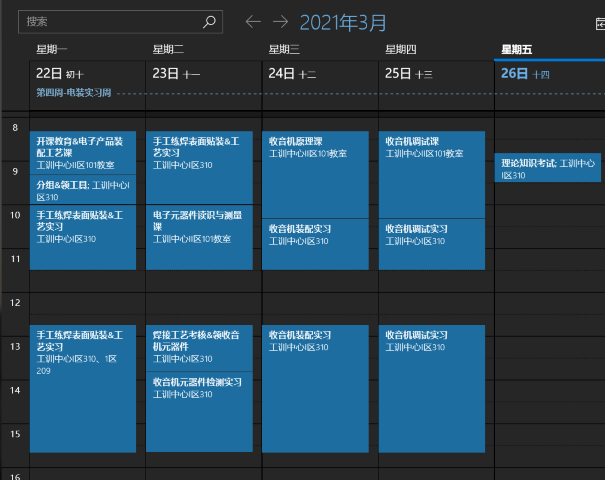
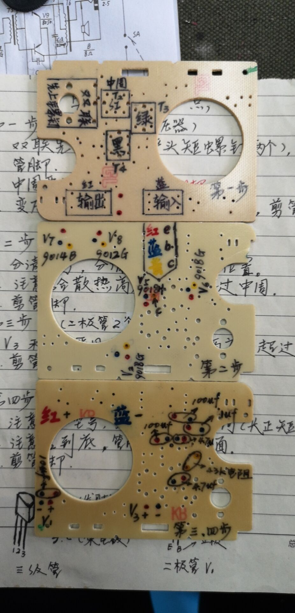

# 电装日记

第四周做完电装实习后填坑。

# Day1

第一天首先会在教室里做一些安全注意事项和纪律要求。注意这一周实习**不要迟到**。

> 第一天的任务是
>
> 1. 学会使用电烙铁，把电路板上面的电阻取下来，再逐个安装到新的电路板上面，再拆下来再装一次。
>
>    进入实习间要发八个工具（剪刀；一字螺丝刀两个，一个金属一个塑料，塑料在调试的时候用来调中周；十字螺丝刀两个；尖嘴钳；斜口钳；剪刀。有的附带锯条，可以刮电烙铁上面的氧化层）、电表、电烙铁等。
>
>    
>
>    
>
>    还会发一批电阻和电路板。
>
>    
>
>    把上面的电阻全部拆下来后，装到新的板子上面，再重复一次这个过程。
>
>    > **要向老师要锡条，锡的熔点低、硬度低，用来固定；焊的时候锡量要少，一般锡条与电烙铁碰一下即可。**
>    >
>    > **使用电烙铁时注意安全，不要触碰金属部分。**
>    >
>    > **焊接点的锡应当是一个小突起，但不会太高，也不会呈半球状或球状（这种情况说明是锡多了）。移开电烙铁要快，不能产生小刺或者气泡。**
>    >
>    > **不拿电烙铁的手在拆电阻时需要抓电路板，建议戴手套，防止烫伤。**
>
>    因为第二天要考试，考试的内容也是同样的过程，因此要注意总结经验，认真一点。
>
>    
>
>    
>
> 2. 在收音机的电路板上面贴装部分元件。
>
> 首先需要在收音机电路板的贴装区域涂上锡膏，这个过程是老师操作的。
>
> 
>
> 
>
> **锡膏涂好后不能碰到其他地方。**你可以这么抓，涂锡膏的面可以朝外也可以朝手心。
>
> 
>
> 接下来需要手装四个小元件，需要用到镊子。**要找准位置再装，装好位置后记得用镊子轻轻按压固定。**
>
> 
>
> 
>
> 电阻是正面黑色标有数字（数字的意义可查询教材第191页，前两位是有效数字，后一位是10的幂，单位为欧姆，如`683`就是68×10³Ω），反面白色，**正面朝外**；电容正反两面相同（金黄色），安装时哪一面朝外都可以。
>
> 其他的元件会在二楼的生产线上装配。
>
> 
>
> 
>
> 
>
> 
>
> 
>
> 
>
> **注意在两个大机器之间的传送带上面一定要看清楚是不是焊了元件（只看其中一个就行，一般情况下要么都有要么都没有）。没有要赶快拿出来然后报告老师。**
>
> 
>
> 从传送带上刚刚下来的电路板温度较高，需要小心拿取。
>
> 

# Day2

第二天要进行焊接考试，内容就是把电阻装到新的电路板上面，和第一天一样。下午就要实战了——焊收音机电路板。

> 
>
> 第一批是要焊接中周、变压器和转轮；第二批是电容器、二极管、三极管等。由于这一块经管的同学没有学过相关知识，因此老师讲的时候要注意听，**尤其是三极管的三个脚**。
>
> 
>
> 
>
> 安装电容器的时候要注意电容的值，安装三极管的时候要注意其型号（这些信息都在电路图和元件上面标注着，要把各个元件和电路图一一对应。）有一个三极管只有两个引脚，要当二极管用，位置在图纸左上角。
>
> 三极管：平面对准自己，从左到右依次为e、b、c；封装的片式三极管V9、V10上为c，左为b，右为e。在图纸上，有箭头的斜线为e，没有斜线的为c，长直线另一边的短直线（这两条直线呈T字形）为b。
>
> 不会装就问老师，老师一般都很耐心。下图可以作为参考。
>
> 

# Day3

这一天安装的东西有：耳机孔、天线、扬声器、音量调节、电池导线。

电源导线、扬声器导线和天线导线在安装时先放锡再放线，**锡要少，要小心，不要弄断线**。**天线上面有四根线，要在图纸上看清四根线的安装位置。**

这一天完成后即可在信号好的位置（如窗口）听到声音，可以收到中国之声。

# Day4

这一天老师会在示波器上调试收音机，调试完成后，安上机壳即可收工。

# 考试重点（可能不完整）

- 软钎焊 P1
- 片式电阻（封装） P190
- 表面安装技术的特点 P186
- 再流焊温度曲线 P218
- 表面安装工艺流程 P209
- 电阻及色标法 P38
- 电容器 P43
- 电感器 P48
- 二极管及半导体 P56
- 调制 P110
- AGC P131
- 整机调试（示波器） P169
- 调试时频率调整 P176
- 中频调整（通频带宽） P129
- 低频调整 P177
- 高频调整 P178
- 通调 P179/180
- f本-f外=465kHz